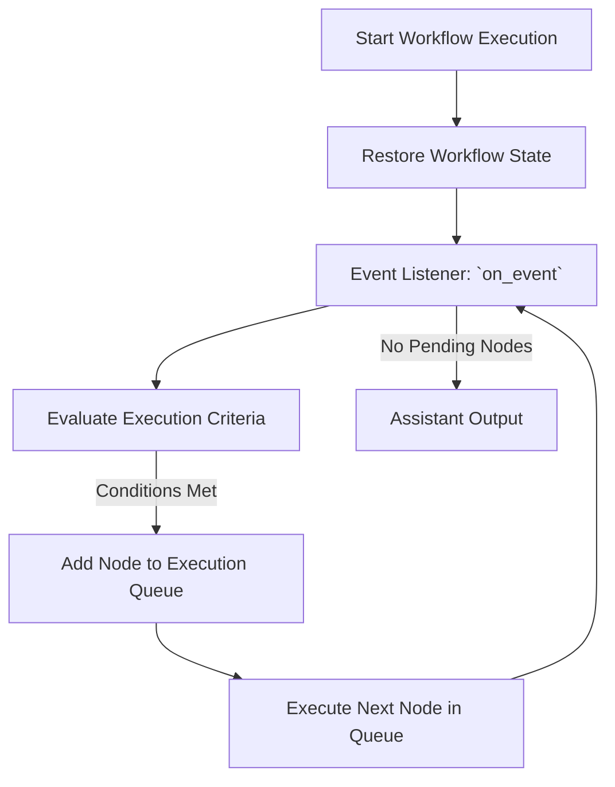
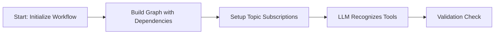

# Documentation

Graphite is an open-source framework designed for building *domain-specific* AI assistants through composable agentic workflows. We provide a highly extensible platform that empowers AI engineers to create custom workflows tailored to their specific business domains.

In this documentation, we'll explore Graphite's architecture and each component in detail, while adhering to our core design philosophy: each component should only know what it needs to know. This principle of minimal coupling enables the flexibility and modularity that makes Graphite powerful.

## Architecture

Below is an overview of the Graphite architecture. In the following sections, we'll break down each component and explore them in detail.


## Assistant

In our platform, the **Assistant** serves as the primary interface between the user and the underlying agent system. Its core responsibility includes processing user input, constructing and managing workflows, and coordinating interactions between users and the workflow components.

### AssistantBase Class

The `AssistantBase` class provides an abstract base interface defining the foundational properties required by all assistants.

#### AssistantBase Class Fields

| Field            | Description                                                         |
|------------------|---------------------------------------------------------------------|
| `assistant_id`   | Unique identifier for the assistant instance.                       |
| `name`           | Human-readable name identifying the assistant.                      |
| `type`           | Category or type specification for the assistant.                   |
| `oi_span_type`   | Semantic attribute from OpenInference for tracing purposes.         |
| `workflow`       | Associated workflow instance managed by the assistant.              |

### Assistant Class

The concrete `Assistant` class extends `AssistantBase`, implementing workflow execution and managing the interactions between user inputs and the agent’s workflow components.

#### Assistant Class Methods

| Method                | Description                                                                                                  |
|-----------------------|--------------------------------------------------------------------------------------------------------------|
| `execute`             | Processes input messages synchronously through the workflow and returns sorted response messages.            |
| `a_execute`           | Processes input messages asynchronously through the workflow, suitable for streaming or concurrent use cases.|
| `_get_consumed_events`| Internally retrieves and processes consumed events from workflow topics.                                     |
| `to_dict`             | Serializes the assistant's workflow state and configuration into a dictionary.                               |
| `generate_manifest`   | Generates a manifest file representing the assistant’s configuration and workflow state.                     |

Both `AssistantBase` and `Assistant` utilize an inner `Builder` class to facilitate structured and configurable construction of Assistant instances, enhancing clarity and ease of use.

Developers can extend the base classes to implement specific business logic or functionality required by their unique applications. By leveraging the provided interfaces, assistants can seamlessly manage complex workflow orchestration and user interaction scenarios.

## Event Driven Workflow

The event-driven workflow serves as the dynamic execution layer of Graphite, orchestrating node execution through a publish/subscribe (pub/sub) model. This architecture structures workflows as interconnected nodes that communicate via event queues (topic), enabling asynchronous, scalable, and flexible processing.

The fields of the event driven workflow is:

| Field Name          | Description                                                                                           |
|---------------------|-------------------------------------------------------------------------------------------------------|
| `name`              | Unique identifier for the workflow instance (default: `"EventDrivenWorkflow"`).                       |
| `type`              | The type identifier for the workflow, typically matching the class name (`"EventDrivenWorkflow"`).    |
| `oi_span_type`      | Semantic attribute from OpenInference used for tracing and observability.                             |
| `nodes`             | Collection of all nodes defined within this workflow.                                                 |
| `topics`            | Dictionary storing all event topics managed by the workflow.                                          |
| `topic_nodes`       | Mapping of topic names to lists of node names subscribed to each topic.                               |
| `execution_context` | Runtime execution context containing state and metadata for the current workflow execution.           |
| `node_queue`        | Queue of nodes that are ready to execute, typically triggered by event availability or workflow state.|

The following table summarizes key functions within the EventDrivenWorkflow class, highlighting their role in managing workflow execution, event handling, and node orchestration:

| Function Name      | Description                                                                                                                                               |
|--------------------|-----------------------------------------------------------------------------------------------------------------------------------------------------------|
| `_publish_events`  | Publishes events to designated workflow topics after a node completes execution.                                                                          |
| `execute`          | Processes nodes from the execution queue sequentially, executing each node as inputs become available until the queue is exhausted.                       |
| `a_execute`        | Asynchronous version of `execute`; initializes the workflow and processes nodes asynchronously, handling streaming nodes differently if required.         |
| `get_node_input`   | Collects and returns input events consumed by a node based on its subscribed topics.                                                                      |
| `on_event`         | Responds to newly published events, evaluates node readiness, and queues nodes for execution if their execution criteria are met.                         |
| `initial_workflow` | Initializes the workflow context, either restoring an unfinished workflow state or setting initial event data for new executions.                         |

The following diagram illustrates the execution flow of a Node within an event-driven workflow:



### Workflow Initialization

When a workflow instance is initialized, it constructs a graph (not necessary a DAG!) based on each node’s subscribed (input) and published (output) topics. Additionally, it attaches function call specifications to the relevant LLM caller node, allowing the LLM to recognize and invoke available tools.



### Node Execution Process

The pub/sub model governs node execution. A node remains idle until all required messages from its subscribed topics become available. Once the conditions are met, the workflow add the node to `execution_queue`. When node executed and publishes the result to designated topics, it triggers the `on_event()` function, which performs the following steps:

1. Identifies all nodes subscribed to the newly published topic.
2. Checks execution criteria for each subscribed node.
3. Queues nodes that meet the criteria for execution.

### Input Preparation & Execution Logic

Before executing a node, the workflow collects all relevant events from its subscribed topics and passes them as input to ensure accurate processing. To support flexible and complex execution logic, the system provides both AND and OR operators:

- AND operator: A node executes only when all required conditions are met.
- OR operator: A node executes when at least one of the required conditions is met.

By combining AND and OR operators, users can construct advanced logic tailored to their specific requirements. However, when using OR logic, it is important to consider potential inconsistencies in execution. Since a node is appended to the `execution_queue` as soon as one OR condition is satisfied, messages from other subscribed topics in the OR condition may or may not appear by the time the workflow prepares the node’s input. This can lead to inconsistencies in data availability, affecting the reliability of execution. Careful design and validation are recommended when implementing OR-based logic to ensure predictable workflow behavior.

### Restoring Unfinished Workflows

A key advantage of this event-driven architecture is its ability to restore and resume unfinished workflows. When `initial_workflow()` is called, the system:

1. Checks if an unfinished workflow exists for the given assistant_request_id.
2. If no unfinished workflow exists, it publishes the input to agent_input_topic, initiating a new workflow execution.
3. If an unfinished workflow exists, it restores the workflow to the last valid state, allowing execution to continue without restarting.

This restoration mechanism is particularly beneficial for human-in-the-loop scenarios, where workflows may pause while awaiting user input. From our perspective, a human-in-the-loop interaction is essentially a paused workflow until a response is received. Beyond human interaction, the ability to resume from failure points is also cost-efficient, as it prevents unnecessary re-execution of previous steps—reducing LLM call costs and optimizing overall performance.

## Node

A Node is a discrete component in a graph-based agent system that operates under an event-driven model. Its primary role is to represent its position within a workflow graph, manage event subscriptions, and designate topics for publishing. In addition, it delegates execution to a Command object, adhering to the Command Pattern. Each Node comprises the following elements:

- Unique Identity
  - Distinguished by a unique node_id, name, and type.
  - The name must be unique within a given workflow.
- Subscribed Topics
  - Stores the event topics to which the node subscribes, typically originating from upstream publishers.
  - Subscriptions can reference explicit topic names or apply custom subscription strategies.
- Publish-To Topics
  - Stores the event topics designated for downstream nodes to subscribe to, facilitating event routing.
- Command for Execution
  - Encapsulates execution logic through a Command object.
  - Allows integration of new or specialized commands without modifying the node’s existing structure.

Node includes the `can_execute()` method, which determines whether the Node is ready for execution based on the availability of events in subscribed topics.

The following table describes each field within the Node class, highlighting its purpose and usage in the workflow:

| Field                    | Description                                                       |
|--------------------------|-------------------------------------------------------------------|
| `node_id`                | A unique identifier for the node instance.                        |
| `name`                   | A unique name identifying the node within the workflow.           |
| `type`                   | Defines the category or type of node, indicating its function.    |
| `command`                | The command object encapsulating node execution logic.            |
| `oi_span_type`           | Semantic attribute from OpenInference for tracing purposes.       |
| `subscribed_expressions` | List of DSL-based subscription expressions used by the node.      |
| `publish_to`             | List of designated topics the node publishes events to.           |
| `_subscribed_topics`     | Internal mapping of subscribed topic names to Topic instances.    |

The following table summarizes the methods available in the Node class, highlighting their purpose and intended usage:

| Method               | Description                                                                                              |
|----------------------|----------------------------------------------------------------------------------------------------------|
| `execute`            | Executes the node's main operation synchronously. Must be overridden by subclasses.                      |
| `a_execute`          | Asynchronous version of `execute`, supporting streaming or asynchronous operations. Must be overridden.  |
| `get_command_input`  | Combines and formats input events appropriately for the node’s execution. Must be overridden.            |
| `can_execute`        | Evaluates subscription conditions to determine whether the node is ready to execute based on new events. |
| `to_dict`            | Serializes node attributes to a dictionary, suitable for persistence or transmission.                    |

Developers can customize Nodes to meet specific business requirements. Below are several common examples demonstrating Nodes frequently adapted for various use cases.

### LLMNode

The `LLMNode` class represents a specialized Node within an event-driven workflow, specifically designed for interactions with Language Models (LLMs). The `LLMNode` aggregates historical messages from all ancestor nodes, serializes them based on dependencies and timestamps, and provides these messages as context for the Language Model to process.

#### LLMNode Class Fields

| Field                   | Description                                                               |
|-------------------------|---------------------------------------------------------------------------|
| `node_id`               | Unique identifier for the LLMNode instance.                               |
| `name`                  | Human-readable name identifying the node (`"LLMNode"` by default).        |
| `type`                  | Specifies the node type (`"LLMNode"`).                                    |
| `oi_span_type`          | Semantic attribute from OpenInference indicating tracing semantics.       |
| `command`               | Command object encapsulating logic for LLM execution.                     |
| `subscribed_expressions`| List of subscription expressions defining topic dependencies.             |
| `publish_to`            | Topics designated for events generated by the node.                       |
| `function_specs`        | Specifications of functions provided to enhance LLM capabilities.         |

#### LLMNode Class Methods

| Method                  | Description                                                                                               |
|-------------------------|-----------------------------------------------------------------------------------------------------------|
| `execute`               | Synchronous method executing the node’s operation; must be overridden in subclasses.                      |
| `a_execute`             | Asynchronous method executing node logic, supporting streaming from LLMs; must be overridden.             |
| `get_command_input`     | Retrieves, orders, and serializes input messages from ancestor nodes, preparing data for LLM processing.  |
| `add_function_spec`     | Adds custom function specifications to enhance interactions with the LLM.                                 |

### LLMFunctionCallNode

The `LLMFunctionCallNode` class represents a specialized Node within an event-driven workflow designed specifically to handle function calls made by a Language Model (LLM). It is responsible for generating function specifications (`function_specs`) utilized by upstream LLMNodes. Additionally, the `LLMFunctionCallNode` processes only messages from parent nodes that contain unprocessed tool call requests.

#### LLMFunctionCallNode Class Fields

| Field          | Description                                                               |
|----------------|---------------------------------------------------------------------------|
| `node_id`      | Unique identifier for the LLMFunctionCallNode instance.                   |
| `name`         | Human-readable identifier for the node (`"LLMFunctionCallNode"` by default).|
| `type`         | Specifies the type of node (`"LLMFunctionCallNode"`).                     |
| `oi_span_type` | Semantic attribute from OpenInference indicating tracing semantics (`CHAIN`).|
| `command`      | Command object encapsulating function call execution logic for LLM interactions.|

#### LLMFunctionCallNode Class Methods

| Method                | Description                                                                                           |
|-----------------------|-------------------------------------------------------------------------------------------------------|
| `execute`             | Processes synchronous function calls extracted from the LLM response and returns function call results.|
| `a_execute`           | Asynchronously executes function calls derived from LLM responses, supporting concurrent operations.   |
| `get_function_specs`  | Retrieves function specifications that the upstream LLMNodes can use for function call interactions.   |
| `get_command_input`   | Filters and retrieves input messages containing unprocessed tool call requests from parent nodes.      |
| `to_dict`             | Serializes the node’s current configuration and state for persistence or debugging.                    |

#### Execution Flow

The `LLMFunctionCallNode` performs the following actions during execution:

- Identifies unprocessed tool call messages from parent nodes.
- Executes function calls based on these identified messages using the provided command.

This structure ensures streamlined and efficient processing of LLM-initiated function calls within complex event-driven workflows.

### RagNode and EmbeddingRetrievalNode

The `EmbeddingRetrievalNode` and `RagNode` classes represent specialized Nodes tailored for specific use cases, such as embedding retrieval and Retrieval-Augmented Generation (RAG). These nodes demonstrate how developers can craft custom nodes and logic tailored to particular requirements.

#### EmbeddingRetrievalNode Class Fields

| Field          | Description                                                                    |
|----------------|--------------------------------------------------------------------------------|
| `node_id`      | Unique identifier for the EmbeddingRetrievalNode instance.                     |
| `name`         | Human-readable name identifying the node (`"EmbeddingRetrievalNode"`).         |
| `type`         | Node type specification (`"EmbeddingRetrievalNode"`).                          |
| `oi_span_type` | Semantic attribute for OpenInference tracing (`RETRIEVER`).                    |
| `command`      | Command object containing embedding retrieval logic.                           |

#### EmbeddingRetrievalNode Class Methods

| Method              | Description                                                                                         |
|---------------------|-----------------------------------------------------------------------------------------------------|
| `execute`           | Performs synchronous embedding retrieval operations and returns results as messages.                 |
| `a_execute`         | Executes embedding retrieval asynchronously, yielding results in a stream of messages.               |
| `get_command_input` | Retrieves the latest message from input events for embedding retrieval queries.                      |
| `to_dict`           | Serializes the node’s configuration and state for persistence or debugging purposes.                 |

#### RagNode Class Fields

| Field          | Description                                                              |
|----------------|--------------------------------------------------------------------------|
| `node_id`      | Unique identifier for the RagNode instance.                              |
| `name`         | Human-readable identifier for the node (`"RagNode"`).                    |
| `type`         | Specifies node type (`"RagNode"`).                                       |
| `oi_span_type` | Semantic attribute for OpenInference tracing (`RETRIEVER`).              |
| `command`      | Command object encapsulating RAG-specific execution logic.               |

#### RagNode Class Methods

| Method              | Description                                                                                        |
|---------------------|----------------------------------------------------------------------------------------------------|
| `execute`           | Performs synchronous RAG operations and returns generated responses as messages.                   |
| `a_execute`         | Executes RAG asynchronously, yielding generated responses in a message stream.                     |
| `get_command_input` | Retrieves the latest message from input events to serve as input for RAG processing.               |
| `to_dict`           | Serializes the node’s configuration and current state for persistence or debugging.                |

These specialized Nodes serve as practical examples, guiding developers to extend or customize Nodes for specific, application-driven use cases within event-driven workflows.

## Command

In our platform, the **Command** implements the Command Pattern, effectively separating workflow orchestration (Nodes) from execution logic (Tools). Commands encapsulate the request or execution logic, allowing the orchestrator (Node) to delegate execution to the executor (Tool) without needing to know the internal details of the execution process.

Using the Command Pattern brings several significant benefits:

- **Separation of Concerns:** Clearly separates orchestration logic from execution logic, making the system more modular.
- **Flexibility and Extensibility:** Allows for easy swapping, extension, and customization of execution logic without altering workflow structures.
- **Improved Maintainability:** Facilitates testing and debugging by isolating command logic within distinct units.

The `Command` interface class itself primarily defines the interface structure and thus does not contain specific instance fields.

| Method           | Description                                                                                         |
|------------------|-----------------------------------------------------------------------------------------------------|
| `execute`        | Defines synchronous execution logic to process inputs and return results; must be implemented by subclasses.|
| `a_execute`      | Defines asynchronous execution logic supporting streaming or concurrent processes; must be implemented by subclasses.|
| `to_dict`        | Serializes command configurations or state for persistence or debugging purposes; must be implemented by subclasses.|

The `Command` interface class utilizes an inner `Builder` class to facilitate structured and step-by-step construction of Command instances, enhancing readability and configurability.

Developers implement custom Commands tailored to specific logic or operational needs by inheriting from this base Command class and overriding the required methods. This approach empowers developers to flexibly craft specialized behaviors while maintaining consistency across the workflow execution environment.

The concrete implementation of `Command` interface should be with its associated tools. Here are some examples.

### LLM Response Command and LLM Stream Command

[`LLMResponseCommand`](/grafi/tools/llms/llm_response_command.py) encapsulates synchronous LLM usage within a command, allowing a node to request the LLM for a response.

Fields:

| Field | Description                                                |
|-------|------------------------------------------------------------|
| `llm` | An `LLM` instance (e.g., OpenAI) that provides the response|

Key methods are:

| Method                                        | Description                                                                                          |
|-----------------------------------------------|------------------------------------------------------------------------------------------------------|
| `execute(execution_context, input_data)`      | Synchronously obtains a single response from the LLM based on the provided messages.                 |
| `a_execute(execution_context, input_data)`    | Asynchronously streams generated messages from the LLM.                                              |
| `to_dict()`                                   | Serializes the command’s state, including its associated LLM configuration.                          |

The [`LLMStreamResponseCommand`](/grafi/tools/llms/llm_stream_response_command.py) specializes `LLMResponseCommand` for stream use cases where synchronous responses must be disabled, and only relies exclusively on asynchronous streaming via a_execute.

### Function Calling Command

[`FunctionCallingCommand`](/grafi/tools/functions/function_calling_command.py) is a concrete implementation of the Command interface that allows a Node to call a `FunctionTool`. By assigning a `FunctionTool` to the command, the Node can trigger function execution without needing to know how arguments are parsed or how the function is actually invoked.

Fields:

| Field             | Description                                                                                 |
|-------------------|---------------------------------------------------------------------------------------------|
| `function_tool`   | A `FunctionTool` instance that encapsulates the registered function and its execution logic.|

Methods:

| Method                                            | Description                                                                                                            |
|---------------------------------------------------|------------------------------------------------------------------------------------------------------------------------|
| `execute(execution_context, input_data)`          | Invokes the `function_tool`'s synchronous `execute` method, returning a list of resulting `Message` objects.           |
| `a_execute(execution_context, input_data)`        | Calls the `function_tool`'s asynchronous `a_execute`, yielding one or more `Message` objects in an async generator.    |
| `get_function_specs()`                            | Retrieves the function specifications (schema, name, parameters) from the underlying `function_tool`.                  |
| `to_dict()`                                       | Serializes the command’s current state, including the `function_tool` configuration.                                   |

By passing a `FunctionTool` to the `function_tool` field, you can seamlessly integrate function-based logic into a Node’s orchestration without embedding execution details in the Node or the tool consumer. This separation keeps workflows flexible and easy to extend.

### Embedding Response Command and RAG Response Command

[`EmbeddingResponseCommand`](/grafi/tools/embeddings/embedding_response_command.py) encapsulates a `RetrievalTool` for transforming input messages into embeddings, retrieving relevant content, and returning it as a `Message`. This command is used by `EmbeddingRetrievalNode`.

`EmbeddingResponseCommand` fields:

| Field                 | Description                                                                      |
|-----------------------|----------------------------------------------------------------------------------|
| `retrieval_tool`      | A `RetrievalTool` instance for embedding-based lookups, returning relevant data  |

`EmbeddingResponseCommand` methods:

| Method                                        | Description                                                                                                    |
|-----------------------------------------------|----------------------------------------------------------------------------------------------------------------|
| `execute(execution_context, input_data)`      | Synchronously calls `retrieval_tool.execute`, returning the resulting `Message`.                               |
| `a_execute(execution_context, input_data)`    | Asynchronously calls `retrieval_tool.a_execute`, yielding one or more `Message` objects.                       |
| `to_dict()`                                   | Serializes the command’s state, including the `retrieval_tool` configuration.                                  |

[`RagResponseCommand`](/grafi/tools/rags/rag_response_command.py) similarly delegates to a `RagTool` that performs retrieval-augmented generation. This command is used by `RagNode`.

`RagResponseCommand` fields:

| Field          | Description                                                                          |
|----------------|--------------------------------------------------------------------------------------|
| `rag_tool`     | A `RagTool` instance for retrieval-augmented generation.                             |

`RagResponseCommand` methods:

| Method                                        | Description                                                                                                          |
|-----------------------------------------------|----------------------------------------------------------------------------------------------------------------------|
| `execute(execution_context, input_data)`      | Synchronously calls `rag_tool.execute`, returning a `Message` with retrieval results.                                |
| `a_execute(execution_context, input_data)`    | Asynchronously invokes `rag_tool.a_execute`, yielding partial or complete messages from the retrieval-augmented flow.|
| `to_dict()`                                   | Serializes the command’s state, reflecting the assigned `RagTool` configuration.                                     |

Both commands enable a node to delegate specialized retrieval operations to their respective tools, without needing to manage the internal logic of how embeddings or RAG processes are performed.

## Tools

In our platform, **Tools** represent the execution components within a workflow. A Tool is essentially a function designed to transform input data into output based on specified rules or logic. Tools can encompass interactions with Language Models (LLMs), external API calls, or purely deterministic functions. Crucially, Tools operate independently of the workflow context—they are unaware of the invoking node or their position within the workflow graph. Each Tool strictly adheres to a defined schema, processing a list of `Message` objects as input and returning a list of `Message` objects as output.

The following table describes each field within the Tool interface class

| Field           | Description                                                               |
|-----------------|---------------------------------------------------------------------------|
| `tool_id`       | Unique identifier assigned to each Tool instance.                         |
| `name`          | Human-readable identifier for the Tool.                                   |
| `type`          | Specifies the category or nature of the Tool.                             |
| `oi_span_type`  | Semantic attribute from OpenInference used for tracing and observability. |

The following table describes each method within the Tool interface class

| Method           | Description                                                                                       |
|------------------|---------------------------------------------------------------------------------------------------|
| `execute`        | Synchronously processes input messages according to the Tool's logic and returns a result message.|
| `a_execute`      | Asynchronously processes input messages, typically used for streaming or concurrent operations.   |
| `to_message`     | Converts the Tool's raw response into a standardized `Message` object.                            |
| `to_dict`        | Serializes the Tool instance into a dictionary format for persistence or debugging.               |

Developers can implement custom Tools tailored to specific business logic or operational requirements. By following the clearly defined interface, new Tools can seamlessly integrate into existing workflows, enhancing modularity, extensibility, and maintainability of the overall system.

Here we introduce some build in tools with corresponding command implementation.

### LLMTool Interface and OpenAITool Implementation

The **LLM** class is a specialized `Tool` designed to interface with Language Model (LLM) services such as OpenAI, Claude, or other third-party providers. It provides both synchronous and asynchronous streaming options, making it suitable for various real-time or batch processing scenarios. By adhering to the base `Tool` interface, it remains compatible with the broader event-driven workflow and command pattern used throughout the system.

#### Fields

| Field            | Description                                                                                            |
|------------------|--------------------------------------------------------------------------------------------------------|
| `tool_id`        | Unique identifier for the LLM tool instance (inherited from `Tool`).                                   |
| `name`           | Human-readable name identifying the LLM tool (inherited from `Tool`).                                  |
| `type`           | Specifies the type of the tool (inherited from `Tool`).                                                |
| `system_message` | An optional system or instructional message to guide the LLM’s behavior.                               |
| `oi_span_type`   | Semantic attribute from OpenInference used for tracing, specifically set to `LLM`.                     |

#### Methods

| Method              | Description                                                                                                  |
|---------------------|--------------------------------------------------------------------------------------------------------------|
| `execute`           | Implements the core logic for synchronous requests (inherited from `Tool`). Must be overridden by subclasses.|
| `a_execute`         | Implements the core logic for asynchronous requests (inherited from `Tool`). Must be overridden.             |
| `stream`            | Provides synchronous streaming functionality, yielding LLM responses as they become available.               |
| `a_stream`          | Provides asynchronous streaming functionality, useful for real-time or larger-scale deployments.             |
| `prepare_api_input` | Prepares input data (list of messages) to match the expected format of the LLM API.                          |
| `to_dict`           | Serializes the LLM tool’s current configuration into a dictionary format.                                    |

#### Usage and Customization

- **Subclasses**: To implement a concrete LLM tool, create a subclass of `LLM` and override `execute`, `a_execute`, `stream`, and `a_stream` methods. This allows for integration with various LLM providers (e.g., OpenAI, Claude) while following a consistent interface.
- **System Message**: You can specify a `system_message` to influence the tone or purpose of the LLM’s responses. This is particularly useful for role-based messaging systems or specialized tasks.
- **API Input Preparation**: Use `prepare_api_input` to adapt your workflow messages into the required schema for each LLM provider’s endpoint, making integration with new or changing APIs more flexible.

By adhering to the `Tool` interface and focusing on LLM operations, the `LLM` class bridges message-based workflows with language model services, ensuring a clean separation of concerns and streamlined integration into the rest of the system.

#### Streaming

We added two stream interface for LLM, adding the user friendly interaction with the agent. However, when we use the stream in assistant, we only use a_stream for async capability.

#### OpenAITool

`OpenAITool` is a concrete implementation of the `LLM` interface, integrating directly with OpenAI’s language model APIs. It supports synchronous and asynchronous interactions, as well as streaming responses for real-time experience.

The OpenAI tool fields are

| Field        | Description                                                                        |
|--------------|------------------------------------------------------------------------------------|
| `name`       | Name of the tool (inherited from `LLM`, defaults to `"OpenAITool"`).               |
| `type`       | Type indicator for this tool (inherited from `LLM`, defaults to `"OpenAITool"`).   |
| `api_key`    | API key required to authenticate with OpenAI’s services.                           |
| `model`      | Model name used for OpenAI API calls (defaults to `"gpt-4o-mini"`).                |
| `chat_params`| Additional optional [chat completion parameters](https://platform.openai.com/docs/api-reference/chat/create)|

The OpenAI tool methods are

| Method          | Description                                                                                                                                               |
|-----------------|-----------------------------------------------------------------------------------------------------------------------------------------------------------|
| `prepare_api_input` | Adapts the list of `Message` objects to match the input schema expected by OpenAI’s API, optionally extracting function tools from the latest message.|
| `execute`       | Synchronous method that calls the OpenAI API using the prepared input, returning a single `Message` as the response.                                      |
| `a_execute`     | Asynchronous version of `execute`, returning responses using an async generator for concurrent or streaming workflows.                                    |
| `stream`        | Deprecated synchronous streaming method that yields partial token results as they become available.                                                       |
| `a_stream`      | Asynchronous streaming method that yields partial token results, useful for real-time applications.                                                       |
| `to_stream_message` | Converts partial response chunks (`ChatCompletionChunk`) from OpenAI’s streaming API into a `Message` object.                                         |
| `to_message`    | Converts a fully realized response (`ChatCompletion`) from OpenAI’s API into a single `Message` object.                                                   |
| `to_dict`       | Serializes `OpenAITool` configuration, hiding the `api_key` for security.                                                                                 |

It will take 3 main steps to finish a request. They are

1. **Prepare Input**: Using `prepare_api_input`, the tool converts incoming messages and any associated function specifications into the OpenAI-compatible format.
2. **Execute or Stream**: Depending on whether you call `execute`/`a_execute` or `stream`/`a_stream`, the tool invokes OpenAI’s API to generate a response, optionally streaming tokens.
3. **Response Conversion**: Partial or complete responses are converted into `Message` objects via `to_stream_message` or `to_message`, enabling uniform handling across the workflow.

When create a openai tool, consider following

- **Builder Pattern**: Use the `Builder` class to specify the API key and model before building an `OpenAITool` instance.
- **Model Customization**: Configure the `model` field (e.g., `"gpt-4"`, `"gpt-4o-mini"`) to target specific OpenAI model endpoints.
- **Key Management**: Provide the `api_key` either as an environment variable (`OPENAI_API_KEY`) or explicitly through the builder.
- **Streaming**: For real-time or large-scale tasks, leverage `a_stream` to handle partial responses incrementally.

By integrating `OpenAITool` into your node-based workflows, you can seamlessly introduce advanced language model capabilities powered by OpenAI, maintaining consistency and modularity throughout the system.

#### OllamaTool

Similar to OpenAI tool, `OllamaTool` is an implementation of the `LLM` interface designed to interface with Ollama’s language model API. It supports synchronous and asynchronous execution patterns, converting workflow `Message` objects into an Ollama-compatible format and translating API responses back into the workflow.

Fields:

| Field      | Description                                                                    |
|------------|--------------------------------------------------------------------------------|
| `name`     | Descriptive identifier for the tool (defaults to `"OllamaTool"`).              |
| `type`     | Tool type indicator (defaults to `"OllamaTool"`).                              |
| `api_url`  | URL of the Ollama API endpoint (defaults to `"http://localhost:11434"`).       |
| `model`    | Ollama model name (defaults to `"qwen3"`).                                   |

Methods:

| Method             | Description                                                                                                       |
|--------------------|-------------------------------------------------------------------------------------------------------------------|
| `prepare_api_input`| Adapts the list of `Message` objects to match Ollama’s expected input format, including function calls if present.|
| `execute`          | Synchronously calls the Ollama API, returning a `Message` with the resulting content or function calls.           |
| `a_execute`        | Asynchronously calls the Ollama API, yielding a `Message` in an async generator for real-time processing.         |
| `to_message`       | Converts Ollama’s raw API response into a `Message`, supporting function call data when present.                  |
| `to_dict`          | Provides a dictionary representation of the `OllamaTool` configuration.                                           |

This tool can be configured with its internal `Builder` class, allowing customization of fields such as the `api_url` or `model` before constructing an instance. By integrating `OllamaTool` into the workflow, developers can leverage local or remote Ollama services without altering the overarching event-driven logic. Messages from the workflow are passed to Ollama, and responses are returned in a consistent format, preserving a clear separation between orchestration and execution logic.

### FunctionTool

`FunctionTool` is designed to allow Language Models (LLMs) to invoke specific Python functions directly through JSON-formatted calls. When a message from the LLM references a particular function name along with arguments, `FunctionTool` checks if it has a function matching that name and, if so, invokes it.

This design greatly reduces the complexity of integrating advanced logic: the LLM simply issues a request to invoke a function, and the tool handles the invocation details behind the scenes.

#### Fields

| Field               | Description                                                                                   |
|---------------------|-----------------------------------------------------------------------------------------------|
| `name`             | Descriptive identifier (defaults to `"FunctionTool"`).                                       |
| `type`             | Tool type (defaults to `"FunctionTool"`).                                                    |
| `function_specs`   | Captures metadata describing the registered function, such as parameter definitions.          |
| `function`         | The actual callable that `FunctionTool` invokes when a function call matches `function_specs`.|
| `oi_span_type`     | Semantic tracing attribute (`TOOL`) for observability.                                        |

#### Methods

| Method               | Description                                                                                                              |
|----------------------|--------------------------------------------------------------------------------------------------------------------------|
| `function` (Builder) | Builder method to register a function. Automatically applies `@llm_function` if not already decorated.                   |
| `register_function`  | Assigns a function to this tool, generating function specs if missing.                                                   |
| `get_function_specs` | Retrieves detailed metadata about the function (including parameter info), enabling structured LLM-based function calls. |
| `execute`            | Evaluates whether incoming messages match the registered function’s name and, if so, calls it with the JSON arguments.  |
| `a_execute`          | Asynchronous equivalent to `execute`, allowing concurrency if the function is a coroutine.                               |
| `to_message`         | Converts execution results into a `Message` object, preserving context like the `tool_call_id`.                          |
| `to_dict`            | Serializes the `FunctionTool` instance, listing function specifications for debugging or persistence.                    |

#### How It Works

1. **Function Registration**: A Python function is wrapped or decorated using `@llm_function`. This generates a schema (`function_specs`) describing its name, arguments, and docstring.
2. **Invocation**: When a message arrives specifying a function call, `FunctionTool` checks whether it corresponds to the registered function’s name.
3. **JSON Parsing**: The arguments are parsed from the `tool_call` field. If they match, the tool dispatches the function call with the given parameters.
4. **Response**: After execution, the returned data is converted into a new `Message`, allowing the workflow to process the function’s output seamlessly.

#### Usage and Customization

- **Builder Pattern**: Use the builder’s `.function(...)` method to assign the function you want to expose. This ensures your function is properly decorated if not already.
- **Flexible**: By simply swapping out the underlying callable, you can quickly adapt to new or updated logic without modifying the rest of the workflow.
- **Observability**: Because `FunctionTool` implements the `Tool` interface and integrates with the event-driven architecture, all executions can be monitored and logged.

With `FunctionTool`, you can integrate specialized Python functions into an LLM-driven workflow with minimal extra overhead. As your system grows and evolves, it provides a clean way to add or modify functionality while retaining a uniform interaction pattern with the LLM.

#### Agent Calling Tool

`AgentCallingTool` extends the `FunctionTool` concept to enable multi-agent systems, allowing an LLM to call another agent by name, pass relevant arguments (as a message prompt), and return the agent’s response as part of the workflow.

Fields:

| Field                  | Description                                                                                                        |
|------------------------|--------------------------------------------------------------------------------------------------------------------|
| `name`                | Descriptive identifier, defaults to `"AgentCallingTool"`.                                                           |
| `type`                | Tool type indicator, defaults to `"AgentCallingTool"`.                                                              |
| `agent_name`          | Name of the agent to call; also used as the tool’s name.                                                            |
| `agent_description`    | High-level explanation of what the agent does, used to generate function specs.                                    |
| `argument_description` | Describes the argument required (e.g., `prompt`) for the agent call.                                               |
| `agent_call`          | A callable that takes `(execution_context, Message)` and returns a dictionary (e.g., `{"content": ...}`).           |
| `oi_span_type`        | OpenInference semantic attribute (`TOOL`), enabling observability and traceability.                                 |

Methods:

| Method           | Description                                                                                                                                                                                                 |
|------------------|-------------------------------------------------------------------------------------------------------------------------------------------------------------------------------------------------------------|
| `get_function_specs` | Returns the function specification (name, description, parameters) for the agent call.                                                                                                                  |
| `execute`        | Synchronously processes incoming tool calls that match `agent_name`, passing the `prompt` to the `agent_call` callable and returning a list of `Message` objects.                                           |
| `a_execute`      | Asynchronous variant of `execute`; yields messages in an async generator for real-time or concurrent agent calls.                                                                                           |
| `to_message`     | Creates a `Message` object from the agent’s response, linking the output to `tool_call_id`.                                                                                                                 |
| `to_dict`        | Serializes all relevant fields, including agent metadata and the assigned callable, for debugging or persistence.                                                                                           |

Here is the workflow example:

1. **Tool Registration**: An `AgentCallingTool` is constructed with details about the agent (`agent_name`, `agent_description`, etc.) and the callable (`agent_call`).
2. **Agent Invocation**: When an LLM includes a tool call referencing this agent’s name, `execute` or `a_execute` receives the `prompt` and calls the agent.
3. **Response Conversion**: The agent’s return value is formed into a new `Message`, which the workflow can then process or forward.

The usage and customization are:

- **Multi-Agent Systems**: By configuring multiple `AgentCallingTool` instances, you can facilitate dynamic exchanges among multiple agents, each specializing in a different task.
- **Runtime Flexibility**: Changing or updating the underlying `agent_call` logic requires no changes to the rest of the workflow.
- **Parameter Schemas**: `argument_description` ensures the LLM knows which arguments are required and how they should be formatted.

By integrating `AgentCallingTool` into your event-driven workflow, you can build sophisticated multi-agent systems where each agent can be invoked seamlessly via structured function calls. This approach maintains a clear separation between the LLM’s orchestration and the agents’ execution details.

#### Example - Weather Mock Tool

A simple mock implementation of a weather service tool that inherits from `FunctionTool`. This class provides a straightforward way to use `FunctionTool`. It is easy to use - just instantiate and call the method. And implements the `FunctionTool` interface for seamless integration. Uses `@llm_function` decorator for automatic registering function.

`@llm_function` is a decorator that enables your Python functions to be seamlessly called by a Language Model (LLM). By inspecting type hints, parsing docstrings, and inferring parameter definitions, this decorator automatically constructs a `FunctionSpec` object that describes your function’s name, parameters (including default values and descriptions), and return type. It then attaches this metadata to the decorated function, making it discoverable and callable within an LLM-driven workflow.

In practical terms, `@llm_function` allows an LLM to dynamically invoke your function with structured, JSON-based arguments. As a result, you can integrate arbitrary Python functions into your dialogue or workflow system without manually encoding parameter details, ensuring consistent and accurate function calls.

```python
class WeatherMock(FunctionTool):

    @llm_function
    async def get_weather_mock(self, postcode: str):
        """
        Function to get weather information for a given postcode.

        Args:
            postcode (str): The postcode for which to retrieve weather information.

        Returns:
            str: A string containing a weather report for the given postcode.
        """
        return f"The weather of {postcode} is bad now."
```

#### Example - Tavily Search Tool

[TavilyTool](/grafi/tools/functions/impl/tavily_tool.py) extends FunctionTool to provide web search capabilities through the Tavily API. In general, when the tool will be reused and needs more complex construction, you can create a class with a builder pattern and apply `@llm_function` to the function that will be called by the LLM. By adding the `@llm_function` decorator to `web_search_using_tavily`, you can integrate web search logic into an LLM-driven workflow with minimal extra configuration.

TavilyTool fields:

| Field           | Description                                                                                                      |
|-----------------|------------------------------------------------------------------------------------------------------------------|
| `name`          | Descriptive identifier for the tool (default: `"TavilyTool"`).                                                   |
| `type`          | Tool type indicator (default: `"TavilyTool"`).                                                                   |
| `client`        | Instance of the `TavilyClient` used for performing search queries.                                               |
| `search_depth`  | Defines the search mode (either `"basic"` or `"advanced"`) for Tavily.                                           |
| `max_tokens`    | Limits the total size (in tokens) of the returned JSON string, preventing overly large responses.                |

`web_search_using_tavily` is decorated with `@llm_function`, so it can be invoked by an LLM using structured arguments. It calls the Tavily API with the specified query, search depth, and maximum results, then returns a JSON string containing relevant matches. The method also checks for maximum token usage before appending items to the output.

Usage example:

1. Instantiate the builder:

```python
tavily_tool = (
    TavilyTool.Builder()
    .api_key("YOUR_API_KEY")
    .search_depth("advanced")
    .max_tokens(6000)
    .build()
)
```

1. A node in your workflow references `TavilyTool` by name and calls `web_search_using_tavily` when requested by the LLM.
2. The LLM sends a JSON function call containing `query` and `max_results`; TavilyTool executes the query and returns JSON-based results.

You can customize TavilyTool by extending `web_search_using_tavily` with additional parameters or logic. This approach maintains a clean, unified interface for integrating search capabilities into an event-driven or node-based workflow.

### Customized Tools

When your requirements exceed what `FunctionTool` can provide, you can implement a custom tool within the framework, ensuring your specialized logic and configuration remain fully integrated into the event-driven workflow.

Here are two examples

#### RetrievalTool

[`RetrievalTool`](/grafi/tools/embeddings/retrieval_tool.py) defines a base interface for embedding-based lookups in an event-driven workflow. It inherits from `Tool` and introduces an `embedding_model` field for custom embedding generation. By default, `RetrievalTool` provides a builder pattern so you can assign an embedding model before instantiation. When the required functionality surpasses this base retrieval capability, you can extend or subclass `RetrievalTool` for more specialized use cases.

The [`ChromadbRetrievalTool`](/grafi/tools/embeddings/impl/chromadb_retrieval_tool.py) is a concrete subclass of `RetrievalTool`, tailored for queries against a ChromaDB collection. It uses an `OpenAIEmbedding` model (or any suitable `OpenAIEmbedding` subclass) to transform input text into vector embeddings, which are then passed to the ChromaDB collection for similarity matching. During `execute` or `a_execute`, the tool retrieves the most relevant documents by comparing the user’s query embedding against stored embeddings in ChromaDB. The resulting matches are serialized into a `Message` object, making the data seamlessly available to the rest of the workflow. Because it inherits from `RetrievalTool`, you can still configure or replace the embedding model as needed.

RetrievalTool fields:

| Field              | Description                                                                      |
|--------------------|----------------------------------------------------------------------------------|
| `name`             | Tool name (default: `"RetrievalTool"`).                                          |
| `type`             | Type identifier (default: `"RetrievalTool"`).                                    |
| `embedding_model`  | Any embedding model (e.g., OpenAIEmbedding) used to encode text for retrieval.   |
| `oi_span_type`     | Specifies an OpenInference span type (`RETRIEVER`), useful for tracing.          |

ChromadbRetrievalTool fields:

| Field              | Description                                                                                           |
|--------------------|-------------------------------------------------------------------------------------------------------|
| `name`             | Tool name (default: `"ChromadbRetrievalTool"`).                                                       |
| `type`             | Type identifier (default: `"ChromadbRetrievalTool"`).                                                 |
| `collection`       | A ChromaDB `Collection` for storing and querying document embeddings.                                 |
| `embedding_model`  | An instance of `OpenAIEmbedding` used to generate embeddings from user queries.                       |
| `n_results`        | Maximum number of results to return when querying ChromaDB.                                           |
| `oi_span_type`     | Specifies an OpenInference span type (`RETRIEVER`), useful for tracing.                               |

Typical usage involves creating an instance of either tool via its builder, providing any required models or indexes. When an input `Message` arrives, the tool encodes the message text using the configured embedding model, queries the retrieval backend (generic or ChromaDB), and returns a `Message` with the matched results. As part of an event-driven workflow, these matches can then be consumed by subsequent nodes or logic.

#### RagTool

[`RagTool`](/grafi/tools/rags/rag_tool.py) is used for `RagNode`, providing a specialized `Tool` for Retrieval-Augmented Generation (RAG) use cases. It integrates with [`llama_index`](https://www.llamaindex.ai/) via a `BaseIndex` instance, allowing your workflow to query stored data or documents and incorporate those results into a context-aware response. Ideal for knowledge-intensive tasks, `RagTool` seamlessly translates user queries into an index lookup, returning relevant information as a `Message`.

Fields:

| Field           | Description                                                                                          |
|-----------------|------------------------------------------------------------------------------------------------------|
| `name`          | Identifier for the tool (default: `"RagTool"`).                                                      |
| `type`          | Type of the tool (default: `"RagTool"`).                                                             |
| `index`         | A `BaseIndex` instance from llama_index for retrieving relevant data.                                |
| `oi_span_type`  | An OpenInference semantic attribute indicating the retriever type (`RETRIEVER`).                     |

Execution flow:

1. `execute` or `a_execute` transforms incoming messages into queries against the assigned `BaseIndex`. For synchronous calls, `execute` returns results immediately; `a_execute` uses asynchronous logic.
2. `as_query_engine()` fetches the relevant documents from the index.
3. `to_message` converts the query result into a `Message`, enabling the rest of the workflow to consume the retrieved information.

Usage example:

```python
rag_tool = (
    RagTool.Builder()
    .index(your_llama_index)  # Where your_llama_index is an instance of BaseIndex
    .build()
)

# In your workflow, supply `rag_tool` with a user query message.
# The tool will query `your_llama_index` and return a Message with the result.
```

Methods:

| Method       | Description                                                                                               |
|-------------|------------------------------------------------------------------------------------------------------------|
| `execute`    | Synchronously queries the index using the input message’s `content` as a query.                           |
| `a_execute`  | Asynchronous version of `execute`; returns the result in an async generator.                              |
| `to_message` | Converts the response from the query engine to a `Message` object, enabling uniform workflow consumption. |
| `to_dict`    | Provides a dictionary representation of the tool, including its fields and the index class name.          |

With `RagTool`, you can incorporate advanced document retrieval capabilities into your node-based workflows, providing context-rich responses sourced from external knowledge bases while maintaining a clean separation between data storage and LLM-driven logic.

## Executor Decorator

Executor decorator record the executor action events, such as invoke, respond, and failed. Each time execute function has been called, the decorate will save the events to the event store. Also it will create tracer and push the tracer to the platform such as phoenix or Arize.

## Models

In the Graphite, varies models provide the fundamental data structures that underpin the event-driven workflow. Message represents the content exchanged between users, assistants, and language models, enabling consistent communication and processing. Event captures the various actions and state changes in the system, from workflow initiation to final outputs. Meanwhile, Topic defines the named channels where events are published and consumed, establishing a structured mechanism for coordinating data flow across the platform.

### Message

`Message` extends OpenAI’s `ChatCompletionMessage`, serving as a standardized data structure for both incoming and outgoing content in the event-driven workflow. Each `Message` instance retains essential metadata such as timestamps, unique identifiers, and optional tool references, facilitating robust and traceable communication between users, assistants, and LLM tools.

#### Fields

| Field           | Description                                                                                               |
|-----------------|-----------------------------------------------------------------------------------------------------------|
| `name`          | An optional name indicating the source or identifier for the message (e.g., function name).               |
| `message_id`    | A unique identifier for the message, defaulting to a generated UUID.                                      |
| `timestamp`     | The time in nanoseconds when the message was created, allowing strict chronological ordering.             |
| `role`          | Specifies the speaker’s role (`system`, `user`, `assistant`, or `tool`).                                  |
| `tool_call_id`  | Associates the message with a particular tool invocation if relevant.                                     |
| `tools`         | An optional list of OpenAI's `ChatCompletionToolParam` for referencing available tool calls.              |

#### Usage Example

```python
from grafi.common.models.message import Message

# Creating a user message
user_message = Message(
    role="user",
    content="What is the capital of France?"
)

# Creating an assistant message
assistant_message = Message(
    role="assistant",
    content="The capital of France is Paris."
)
```

In both cases, the `Message` class provides a consistent structure for storing conversation state, bridging the gap between OpenAI’s chat messages and the system’s event-driven architecture.

### Event

`Event` is the foundational data model in the event driven architecture, capturing the common fields and logic shared by all event types. Each subclass of `Event` (e.g., Node events, Topic events) extends this base with specialized data. The core `Event` model also offers a standard interface for serialization (`to_dict`) and deserialization (`from_dict`), promoting consistency across the platform.

The `Event` fields are:

| Field              | Description                                                                                         |
|--------------------|-----------------------------------------------------------------------------------------------------|
| `event_id`         | Unique identifier for the event, defaulting to a generated UUID.                                    |
| `execution_context`| A reference to the workflow’s current state, including assistant request details and other metadata.|
| `event_type`       | An `EventType` enum value describing the kind of event (e.g., NodeInvoke, ToolRespond).             |
| `timestamp`        | The UTC timestamp of event creation, used for ordering and auditing.                                |

The benefits are:

- **Consistency**: All events adhere to the same schema for IDs, context, and timestamps.
- **Extensibility**: Subclasses can introduce additional fields while still retaining base serialization logic.
- **Traceability**: The shared timestamp and `execution_context` fields provide a reliable audit trail.

By leveraging this **Event** model, the system enforces uniform data handling for everything from node invocations to assistant responses, simplifying debugging and logging throughout the workflow lifecycle.

#### Component activity event

In the Graphite’s layered architecture, each principal component (Assistant, Node, Tool, and Workflow) can invoke, respond, or fail during execution. And there are events associate with each actions, such as invoke  event, respond event and failed event. For nodes specifically, these actions are tracked as three distinct event types:

1. **NodeInvokeEvent**: The node is invoked with input data.
2. **NodeRespondEvent**: The node completes execution and returns output data.
3. **NodeFailedEvent**: The node encounters an error during execution.

These events capture the inputs, outputs, timestamps, and other metadata essential for observing and debugging node behavior.

Here is the `Node` base event `NodeEvent`:

| Field                | Description                                                                  |
|----------------------|------------------------------------------------------------------------------|
| `node_id`            | Unique identifier for the node. Defaults to a generated UUID.                |
| `node_name`          | Human-readable name of the node.                                             |
| `node_type`          | Describes the functional category of the node (e.g., "LLMNode").             |
| `subscribed_topics`  | The list of event topics to which this node is subscribed.                   |
| `publish_to_topics`  | The list of event topics where the node publishes output.                    |
| `execution_context`  | Workflow metadata, including request details and IDs.                        |
| `event_type`         | The specific event variant: `NODE_INVOKE`, `NODE_RESPOND`, or `NODE_FAILED`. |
| `timestamp`          | The UTC timestamp when the event was generated.                              |

and the `Node` base event methods

| Method                      | Description                                                                                                   |
|-----------------------------|---------------------------------------------------------------------------------------------------------------|
| `node_event_dict()`         | Returns a dictionary merging base event data (`event_dict()`) with node-specific fields (e.g., ID, topics).   |
| `node_event_base()`         | Class method that reconstructs node-specific fields (like `node_id` and `node_name`) from a dictionary.       |
| `event_dict()`              | Inherited from `Event`; provides flattening of `execution_context` and standard event metadata.               |
| `event_base()`              | Inherited from `Event`; extracts `event_id`, `event_type`, and `timestamp` from a serialized event.           |
| `to_dict()` / `from_dict()` | Implemented in subclasses, each adjusts data serialization or deserialization for the event’s unique fields.  |

`NodeInvokeEvent` extended from  `NodeEvent`, with additional field:

| Field       | Description                                                                                    |
|-------------|------------------------------------------------------------------------------------------------|
| `input_data`| A list of `ConsumeFromTopicEvent` representing the node’s consumed messages upon invocation.   |

`NodeInvokeEvent` implemented the serialise and deserialise methods `to_dict()` and `from_dict(data)`.  

| Method            | Description                                                                                                                                 |
|-------------------|---------------------------------------------------------------------------------------------------------------------------------------------|
| `to_dict()`       | Returns the merged dictionary from `node_event_dict()` plus the serialized list of input events (`input_data`).                             |
| `from_dict(data)` | Class method that calls `node_event_base` for the base event fields, then rebuilds `input_data` by deserializing each consumed event dict.  |  

`NodeRespondEvent` extended from `NodeEvent`, with two additional fields:

| Field         | Description                                                                                     |
|---------------|-------------------------------------------------------------------------------------------------|
| `input_data`  | A list of `ConsumeFromTopicEvent` messages that the node consumed.                              |
| `output_data` | The resulting message(s) (`Message` or list of `Message`) produced by the node’s execution.     |

`NodeRespondEvent` implemented the serialise and deserialise methods `to_dict()` and `from_dict(data)`.

| Method          | Description                                                                              |
|-----------------|------------------------------------------------------------------------------------------|
| `to_dict()`     | Calls `node_event_dict()` and includes JSON-serialized `output_data`.                    |
| `from_dict()`   | Deserializes `input_data` and `output_data`; uses `node_event_base` for common fields.   |

`NodeFailedEvent` extended from  `NodeEvent`, with additional field:

| Field         | Description                                                                                           |
|---------------|-------------------------------------------------------------------------------------------------------|
| `input_data`  | A list of `ConsumeFromTopicEvent` messages that led to this error condition.                          |
| `error`       | Contains information about the error encountered (stack trace, message, or custom error object).      |

`NodeFailedEvent` implemented the serialise and deserialise methods `to_dict()` and `from_dict(data)`.

| Method          | Description                                                                                      |
|-----------------|--------------------------------------------------------------------------------------------------|
| `to_dict()`     | Uses `node_event_dict()` and adds an `error` field.                                              |
| `from_dict()`   | Builds the event from `node_event_base`, restoring `input_data` and capturing `error` details.   |

Collectively, these **Node Activity Events** form a consistent pattern for tracking node lifecycle across invoke, respond, and fail states. The same concept applies to other components in the system (e.g., Assistant, Tool, Workflow), each featuring its respective invoke, respond, and failed events. This design ensures clear traceability and systematic error handling within the event-driven workflow architecture.

#### Publish and Subscribe Event

Publish and subscribe events capture data published to or consumed from specific channels - topics - in the system. They enable Nodes to communicate asynchronously by sending and receiving messages on named topics. The platform distinguishes three main types:

1. **PublishToTopicEvent**: Emitted when data is published to a topic.
2. **ConsumeFromTopicEvent**: Occurs when a consumer retrieves data from a topic.
3. **OutputTopicEvent**: A special publish event intended for final user-facing outputs, typically consumed by an Assistant.

`TopicEvent` is the base event, it extends from `Event` class, and added following fields

| Field               | Description                                                                                     |
|---------------------|-------------------------------------------------------------------------------------------------|
| `topic_name`        | Identifies the topic to which this event pertains (e.g., "agent_input", "agent_output").        |
| `offset`            | A numeric indicator of the event’s position in the topic stream.                                |
| `data`              | The message(s) (or generator of messages) being transferred.                                    |
| `event_id`          | Inherited from `Event`; unique identifier for this event.                                       |
| `event_type`        | Inherited from `Event`; marks it as a topic event variant (e.g., `PUBLISH_TO_TOPIC`).           |
| `timestamp`         | Inherited from `Event`; records the time the event was created (UTC).                           |
| `execution_context` | Inherited from `Event`; includes metadata such as `assistant_request_id` for tracing.           |

`TopicEvent` has following methods:

| Method                    | Description                                                                                                 |
|---------------------------|-------------------------------------------------------------------------------------------------------------|
| `topic_event_dict()`      | Combines base event data (`event_dict()`) with topic-specific fields and JSON-serialized `data`.            |
| `topic_event_base(dict)`  | Class method that deserializes topic data (including `Message` objects) and merges with base event fields.  |
| `event_dict()`            | From the `Event` class; flattens `execution_context` and includes standard metadata (event ID, type, etc.). |
| `event_base(dict)`        | From the `Event` class; extracts `event_id`, `event_type`, and `timestamp`.                                 |
| `to_dict() / from_dict()` | Implemented in each subclass, customizing how `data` or additional fields are serialized.                   |

`PublishToTopicEvent` extends `TopicEvent` with following additional fields

| Field                | Description                                                                                     |
|----------------------|-------------------------------------------------------------------------------------------------|
| `consumed_event_ids` | A list of event IDs indicating which prior events (e.g., consumed messages) led to this publish.|
| `publisher_name`     | The name of the component (Node, Assistant, etc.) publishing the data.                          |
| `publisher_type`     | The type/category of the publisher (e.g., "Node", "Assistant").                                 |

`PublishToTopicEvent` implemented the following methods

| Method                | Description                                                                                         |
|-----------------------|-----------------------------------------------------------------------------------------------------|
| `to_dict()`           | Adds `consumed_event_ids`, `publisher_name`, and `publisher_type` to the standard topic event dict. |
| `from_dict(dict)`     | Recreates the event by merging base topic fields with the additional publisher-related fields.      |

`ConsumeFromTopicEvent` extends `TopicEvent` with following additional fields

| Field            | Description                                                                       |
|------------------|-----------------------------------------------------------------------------------|
| `consumer_name`  | The name of the component consuming the data (Node, Assistant, etc.).             |
| `consumer_type`  | The category or type of the consumer (e.g., "Node", "Assistant").                |

`ConsumeFromTopicEvent` implemented the following methods

| Method            | Description                                                                                         |
|-------------------|-----------------------------------------------------------------------------------------------------|
| `to_dict()`       | Adds consumer-specific fields (`consumer_name`, `consumer_type`) to the base topic event data.      |
| `from_dict(dict)` | Restores the consume event by parsing both base topic fields and the consumer-related fields.       |

`OutputTopicEvent` is a special form of `PublishToTopicEvent` used exclusively for final outputs. Typically consumed by an **Assistant** to relay data back to the user.

`OutputTopicEvent`'s additional details are

- **EventType** is fixed to `OUTPUT_TOPIC`.
- `data` can be a single `Message`, multiple `Message` objects, or a generator of messages. Currently, serialization is pending further implementation.

`OutputTopicEvent` implemented the following methods

| Method            | Description                                                                               |
|-------------------|-------------------------------------------------------------------------------------------|
| `to_dict()`       | Extends `PublishToTopicEvent.to_dict()`, placeholder for future data serialization logic. |
| `from_dict(dict)` | Placeholder for data deserialization from a dictionary, to be implemented.                |

These topic-based events enable decoupled communication within the system. **PublishToTopicEvent** moves data onto a topic, **ConsumeFromTopicEvent** retrieves it, and **OutputTopicEvent** designates final user-facing outputs. By standardizing how messages flow through topics, the platform ensures reliability, traceability, and straightforward integration among nodes, assistants, and tools.

### Topic

`TopicBase` and `Topic` represent logical message queues in the event-driven workflow. They temporarily store messages in a First-In-First-Out (FIFO) fashion and track how many messages each consumer has read using an offset system. This allows components—like Nodes, Assistants, or Tools—to communicate asynchronously by publishing and consuming messages.

#### TopicBase

`TopicBase` provides the core interface and data structures for managing published events, consumption offsets, and conditions used to filter which messages are accepted.

Fields:

| Field                      | Description                                                                                   |
|----------------------------|-----------------------------------------------------------------------------------------------|
| `name`                     | The topic’s human-readable name.                                                              |
| `condition`                | A function deciding if incoming messages should be published to this topic. Defaults to True. |
| `publish_event_handler`    | An optional callback that runs after a successful publish.                                    |
| `topic_events`             | A list of `TopicEvent` objects representing messages accepted by the topic.                   |
| `consumption_offsets`      | Maps consumer identifiers to the index of the last message they consumed.                     |

Methods:

| Method                              | Description                                                                                                                                |
|-------------------------------------|--------------------------------------------------------------------------------------------------------------------------------------------|
| `publish_data(...)`                 | Publishes data to the topic if it meets the `condition`. Must be implemented in subclasses.                                                |
| `can_consume(consumer_name)`        | Checks if a consumer has unread messages in this topic.                                                                                    |
| `consume(consumer_name)`            | Retrieves the unread messages for the consumer, updates its offset, and returns the relevant events.                                       |
| `reset()`                           | Clears `topic_events` and `consumption_offsets`, effectively reverting the topic to its initial state.                                     |
| `restore_topic(topic_event)`        | Rebuilds the topic’s state from a `TopicEvent`, adding to `topic_events` or adjusting consumption offsets.                                 |
| `to_dict()`                         | Serializes basic fields like `name` and `condition`.                                                                                       |
| `serialize_callable()`              | Helper that extracts details about the `condition` function (e.g., lambda source code or function name).                                   |

`TopicBase` also includes a builder pattern that simplifies creating and customizing topics (e.g., adding a `condition`). Subclasses extend `publish_data`, `can_consume`, and `consume` to store and retrieve messages in a more concrete manner.

#### Topic

`Topic` is a direct subclass of `TopicBase` that implements the required methods for a working FIFO message queue. Components publish via `publish_data`, and consumers read new messages via `consume`, each consumer having an independent offset.

`Topic` shares all fields from `TopicBase` and does not introduce additional fields beyond its default name.

Methods:

| Method                              | Description                                                                                                               |
|-------------------------------------|---------------------------------------------------------------------------------------------------------------------------|
| `publish_data(...)`                 | Creates a `PublishToTopicEvent` if the `condition` is met and calls `publish_event_handler` to handle event.              |
| `can_consume(consumer_name)`        | Checks if `consumer_name`’s offset is behind `len(topic_events)`, meaning there are new, unread messages.                 |
| `consume(consumer_name)`            | Retrieves unconsumed messages, updates the consumer’s offset, and returns the new events.                                 |

A typical workflow involves creating a `Topic` instance (or more specialized subclass), optionally setting a `condition` to filter messages, and then connecting nodes or assistants that publish or consume messages. Whenever data is published, `Topic` increments the offset and stores the new event. When a consumer checks `can_consume`, the topic compares its offset with the total published messages to determine if any remain unread.

This design ensures that each consumer reads messages in the correct order, preserving FIFO behavior while enabling asynchronous, distributed interactions across the event-driven workflow.

#### Output Topic

`OutputTopic` is a specialized subclass of `Topic` designed for user-facing events. When data is published to an `OutputTopic`, it uses `OutputTopicEvent` rather than a standard `PublishToTopicEvent`, indicating that these messages should ultimately be returned to the user.

Fields:

| Field                      | Description                                                                                                    |
|----------------------------|----------------------------------------------------------------------------------------------------------------|
| `name`                     | Defaults to `AGENT_OUTPUT_TOPIC`, representing the system’s standard output channel.                           |
| `publish_event_handler`    | An optional callback that executes whenever an `OutputTopicEvent` is successfully published.                   |
| `topic_events`             | A list of `OutputTopicEvent` objects, maintaining the published output messages in FIFO order.                 |
| `consumption_offsets`      | Maps consumer identifiers (e.g., assistant names) to the last read event offset, ensuring each reads in order. |

Methods:

| Method                            | Description                                                                                                                |
|-----------------------------------|----------------------------------------------------------------------------------------------------------------------------|
| `publish_data(...)`               | Creates an `OutputTopicEvent` with the given messages if the `condition` is met. Append event to topic, then call handler. |
| `_publish(event)`                 | Inherited from `TopicBase`; assigns an offset and appends the event to `topic_events` if allowed by `condition`.           |

Use Case:

Typically, an assistant consumer will subscribe to the OutputTopic to retrieve user-facing results. By separating output into a dedicated topic, the system can more easily track final responses, funneling them back to the user through consistent workflows.

#### Human Request Topic

`HumanRequestTopic` is a specialized extension of `Topic` dedicated to handling requests that require human intervention or input. When the workflow needs user input, it publishes an `OutputTopicEvent` to `HumanRequestTopic`. On the user’s response, that input is appended back to the same topic, keeping the entire request-response cycle self-contained.

Fields:

| Field                            | Description                                                                                                          |
|----------------------------------|----------------------------------------------------------------------------------------------------------------------|
| `name`                           | Defaults to `HUMAN_REQUEST_TOPIC`, indicating it’s the main channel for human-driven requests.                       |
| `publish_to_human_event_handler` | A callback triggered after successfully publishing an `OutputTopicEvent` for user-facing interactions.               |
| `topic_events`                   | A list of `TopicEvent` (or `OutputTopicEvent`) objects, preserving a history of user requests and appended responses.|
| `consumption_offsets`            | Maps consumer identifiers to the offset of the last read event, enabling a FIFO workflow for multiple consumers.     |

Methods:

| Method                                        | Description                                                                                                               |
|-----------------------------------------------|---------------------------------------------------------------------------------------------------------------------------|
| `publish_data(...)`                           | Publishes data to the topic as an `OutputTopicEvent` and add to topic if `condition` is met. Then invoke `publish_to_human_event_handler`|
| `can_append_user_input(consumer_name, event)` | Check if can add the user input event given its parent `PublishToTopicEvent`.                                             |
| `append_user_input(user_input_event, data)`   | Appends actual user responses using a standard `PublishToTopicEvent`, ensuring they become available for downstream nodes.|

Usage:

1. **Publishing Requests**: When a node or another component needs user input, it calls `publish_data(...)` on `HumanRequestTopic`, generating an `OutputTopicEvent`. This signals the assistant to display or relay a query to the user.
2. **Appending User Input**: After the user responds, the assistant (or another client) calls `append_user_input(...)`, creating a `PublishToTopicEvent` that effectively stores the user’s messages in the same topic.
3. **Downstream Consumption**: Any node subscribed to the `HumanRequestTopic` can consume new messages as they appear, enabling further automated logic once the user’s response is available.

Rational:

By splitting user interaction into distinct publish and append steps, the system provides a clear interface for capturing requests and responses, all under a single, specialized topic designed for human-driven workflows.

#### Topic Expression

**Topic Expression** provides a mini DSL (Domain-Specific Language) for building complex subscription logic based on multiple topics. By combining topic references using logical operators (AND, OR), you can specify whether a node should wait for messages in all required topics (`AND`) or at least one of several possible topics (`OR`). This approach offers a flexible way to manage event-driven subscriptions.

Models

`LogicalOp`

| Enum Value | Description                                  |
|------------|----------------------------------------------|
| `AND`      | Both sides must be satisfied for expression  |
| `OR`       | At least one side must be satisfied          |

`SubExpr` (Base Class)

| Class    | Description                                          |
|----------|------------------------------------------------------|
| `SubExpr`| Abstract base class for any subscription expression. |

`TopicExpr` (extended from `SubExpr`)

| Field         | Description                                                               |
|---------------|---------------------------------------------------------------------------|
| `topic`       | A `TopicBase` object representing a single topic in the subscription tree.|

`TopicExpr` states that a subscriber is interested in a single topic. If new, unread messages exist in that topic, the expression evaluates to `True`.

`CombinedExpr` (extended from `SubExpr`)

| Field   | Description                                                                   |
|---------|-------------------------------------------------------------------------------|
| `op`    | A `LogicalOp` indicating `AND` or `OR`.                                       |
| `left`  | Another `SubExpr` node.                                                       |
| `right` | Another `SubExpr` node.                                                       |

`CombinedExpr` composes two sub-expressions with a logical operator, enabling complex nested conditions.

Methods

| Method                                              | Description                                                                                                                                                                           |
|-----------------------------------------------------|---------------------------------------------------------------------------------------------------------------------------------------------------------------------------------------|
| `evaluate_subscription(expr, topics_with_new_msgs)` | Checks whether a subscription expression (`expr`) is fulfilled by the given list of topics that have new messages. Returns `True` if the condition is met (based on `AND`/`OR` logic).|
| `extract_topics(expr)`                              | Recursively collects all `TopicBase` objects from the DSL expression tree, letting the system know which topics a node depends on.                                                    |

Key Points:

1. **Flexibility**: You can nest multiple expressions to create complex logic. For instance, `(TopicA AND (TopicB OR TopicC))`.
2. **Maintainability**: By separating subscription logic into DSL expressions, the system remains clear and easy to debug.
3. **Integration**: Each `TopicExpr` references an actual `TopicBase`, ensuring that the DSL and the underlying queue system stay in sync.

#### Subscription Builder

`SubscriptionBuilder` streamlines the process of creating complex topic subscription expressions, allowing you to chain logical operations (`AND`, `OR`) and define whether a node requires messages from multiple topics or at least one. This builder pattern provides a concise DSL for specifying these conditions without manually constructing `TopicExpr` and `CombinedExpr` objects.

Fields:

| Field           | Description                                                                                           |
|-----------------|-------------------------------------------------------------------------------------------------------|
| `root_expr`     | The current root of the subscription expression tree (`SubExpr`), built incrementally by chaining.    |
| `pending_op`    | A `LogicalOp` (AND/OR) that awaits completion of the next `subscribed_to(...)` call.                  |

Methods:

| Method                                       | Description                                                                                                                             |
|----------------------------------------------|-----------------------------------------------------------------------------------------------------------------------------------------|
| `subscribed_to(topic: TopicBase)`            | Adds a new `TopicExpr` node referencing `topic`. If `pending_op` is set, combines it with the existing `root_expr` via a `CombinedExpr`.|
| `and_()`                                     | Sets `pending_op` to `LogicalOp.AND`, indicating the next topic reference should form an AND relationship.                              |
| `or_()`                                      | Sets `pending_op` to `LogicalOp.OR`, indicating the next topic reference should form an OR relationship.                                |
| `build()`                                    | Finalizes the builder, returning the constructed `SubExpr`.                                                                             |

Usage Example:

```python

# Suppose you have two Topic objects: topicA and topicB
# Build an expression: (topicA AND topicB)
subscription_expr = (
    SubscriptionBuilder()
    .subscribed_to(topicA)
    .and_()
    .subscribed_to(topicB)
    .build()
)

# The resulting expression can be assigned to a node, which then requires new messages from both topics.
node_builder.subscribed_to(subscription_expr)
```

Key Points:

1. **Chained Syntax**: The builder pattern enables a straightforward DSL-like syntax: `.subscribed_to(topicA).and_().subscribed_to(topicB).build()`.
2. **Operator Checks**: If `and_()` or `or_()` is called without a subsequent `subscribed_to(...)`, or vice versa, a `ValueError` is raised.
3. **Integration**: Once created, the resulting `SubExpr` can be evaluated against incoming messages with `evaluate_subscription()` or used for introspection with `extract_topics()`. This provides flexible, powerful subscription logic for nodes in an event-driven system.

#### Reserved Topics

These topics are reserved for essential system operations in the event-driven workflow, ensuring consistent handling of inputs, outputs, and user-interactive events.

1. Input Topic
    - **`agent_input_topic`**: Receives user or external inputs, starting the workflow by providing initial messages or commands for further processing.
2. Output Topics
    - **`agent_stream_output_topic`**: Streams partial or incremental responses during long-running or asynchronous operations. Typically used for real-time updates.
    - **`agent_output_topic`**: Publishes final agent responses that are ready to be returned to the user or external systems. The `Assistant` is the only consumer of this topic.
3. Human Request Topic
    - **`human_request_topic`**: A special topic for user involvement. When the system needs additional information or confirmation from humans, it posts requests here; once the user responds, messages are appended to the same topic and become available for downstream processing.

Using these reserved topics helps maintain a clear, consistent architecture for input processing, output streaming, final responses, and human-driven request handling. They are key building blocks for standardizing communication across the workflow.

### Event Graph

`EventGraph` organizes events (particularly `ConsumeFromTopicEvent` and `PublishToTopicEvent`) into a directed graph structure. It traces how messages flow from published events through consumed ones, enabling advanced operations like retrieving a sorted sequence of all ancestor messages. This is especially important for Large Language Model (LLM) interactions, where the full conversation history (including intermediate nodes) must be serialized in a coherent, chronological order.

#### Fields

| Field        | Description                                                                                                  |
|--------------|--------------------------------------------------------------------------------------------------------------|
| `nodes`      | A dictionary mapping event IDs to `EventGraphNode` objects.                                                  |
| `root_nodes` | A list of `EventGraphNode` objects representing the starting points (e.g., directly consumed events).        |

#### Methods

| Method                                | Description                                                                                                                                                                                |
|---------------------------------------|--------------------------------------------------------------------------------------------------------------------------------------------------------------------------------------------|
| `_add_event(event)`                   | Creates a new `EventGraphNode` for a given `Event` if it does not already exist.                                                                                                           |
| `build_graph(consume_events, topic_events)` | Constructs the event graph from a list of consume events and a dictionary of topic events. It links each consume event to its corresponding publish event, building upstream/downstream refs.|
| `get_root_event_nodes()`              | Returns the root nodes, i.e., the events that begin sub-graphs (often direct consume events).                                                                                               |
| `get_topology_sorted_events()`        | Performs a custom topological sort, ordering events by reverse timestamp within each dependency layer, and then reversing the result for ascending chronological output.                    |
| `to_dict()`                           | Serializes the entire graph, including each node’s event and references.                                                                                                                   |
| `from_dict(...)`                      | Deserializes the graph from a dictionary, recreating each `EventGraphNode`.                                                                                                                |

#### Rationale for Topological and Timestamp Sorting

When feeding conversation or workflow history to an LLM, it’s crucial to maintain logical and temporal ordering of all ancestor events. By combining topological ordering with timestamp-based sorting, the `EventGraph` ensures:

1. **Correct Causality**: Dependencies (publish -> consume) appear before reliant events.
2. **Chronological Consistency**: Events with similar dependency levels are ordered by their actual creation time.
3. **Complete Context**: The LLM receives a fully serialized token sequence of all ancestor interactions, enabling more coherent responses.

By leveraging the `EventGraph` class, developers can reliably trace the chain of message publications and consumptions, producing a robust representation of the workflow’s complete ancestry—critical for advanced LLM tasks or debugging complex distributed processes.

## Conventional Rules

While the platform is designed for maximum flexibility, certain conventions guide how components interact. These rules ensure consistency, maintainability, and ease of integration across a range of use cases—especially when handling user requests, generating outputs, and enabling powerful LLM features.

### Reserved Topics

#### Agent Input Topic

- **Triggering the Workflow**: All new assistant requests with a fresh `assistant_request_id` begin by publishing the user input to the **agent_input_topic**.
- **Downstream Consumption**: Nodes that need to process initial requests consume from this topic, triggering the rest of the workflow.

#### Agent Output Topics

- **Final Responses**: All output events route to **agent_output_topic**, which the Assistant consumes to return data to the user or caller.
- **Single Consumer**: Only the Assistant should subscribe to this topic, avoiding conflicting read operations.

#### Human Request Topic

- **Human in the Loop**: Used when user intervention is required; the system posts an `OutputTopicEvent` here, which the Assistant can consume to display prompts or questions.
- **User Response**: When the user replies, `append_user_input()` posts a `PublishToTopicEvent` (the user’s answer). This message is then read by downstream nodes.
- **Assistant Role**: The Assistant only consumes `OutputTopicEvent` objects, while nodes consume both the question (`OutputTopicEvent`) and the final user reply (`PublishToTopicEvent`).

**Rationale**: Structuring input and output channels ensures clarity, preventing multiple consumers from inadvertently processing final outputs and providing a clear path for user-driven requests.

### OutputTopicEvent

- **Dedicated for Assistant**: If a newly received event is an `OutputTopicEvent`, the workflow’s `on_event()` skips subscription checks, since only the Assistant should consume it.
- **Exclusive Destination**: `OutputTopicEvent` can only be published to **agent_output_topic** or **human_request_topic**, ensuring a clear boundary for user-facing outputs.

**Rationale**: Limiting `OutputTopicEvent` usage avoids confusion over who should read final results, reinforcing the principle of single responsibility for returning data to the user.

### Stream Usage

- **Output Only**: Streaming is only relevant for final outputs, letting the LLM emit partial content in real time.
- **Asynchronous Requirement**: Nodes, workflows, and assistants do not support synchronous streaming. Though the LLM tool may have a synchronous stream function, the system’s architecture uses async flows.
- **Usage Pattern**: For practical examples, see `stream_assistant`; it shows how to handle partial token streams differently from normal async generators.

**Rationale**: Maintaining an async-only stream approach for nodes, workflows, and assistants simplifies concurrency, reduces potential race conditions, and provides a consistent development experience.

### LLMFunctionCall

- **Agent-Like Interactions**: By calling functions, the LLM can access additional tools—making the system more agent-like.
- **Separation of Concerns**: The LLM node focuses on generating or interpreting responses, while a separate `LLMFunctionCall` node invokes tool logic.
- **Upstream Connections**: Each `LLMFunctionCall` must directly connect to one or more LLM node via topic(s) when want to enable upstream LLM node tool calling feature.
- **Downstream Connections**: Each LLM node can directly connect to one or more `LLMFunctionCall` nodes. If the workflow builder detects an `LLMFunctionCall` node downstream, it attaches the relevant function specs to the LLM node’s final output message, letting the LLM know which tools are available.

**Rationale**: Decoupling LLM operations from tool invocation keeps the graph modular, fosters reusability, and ensures that an LLM can dynamically discover and call specialized tools within a single workflow.

## Features

The core design principles that set Graphite apart from other agent frameworks are:

1. **A Simple 3-Layer Execution Model**  
   Three distinct layers—assistant, node, and tool—manage execution, while a dedicated workflow layer oversees orchestration.

2. **Pub/Sub Event-Driven Orchestration**  
   Communication relies on publishing and subscribing to events, ensuring a decoupled, modular flow of data throughout the system.

3. **Events as the Single Source of Truth**  
   All operational states and transitions are recorded as events, providing a uniform way to track and replay system behavior if needed.

Combining these elements, **Graphite** provides a production-grade AI application framework capable of operating reliably at scale, handling failures gracefully, and maintaining user and stakeholder trust. Four essential capabilities form the backbone of this approach:

1. **Observability**  
   Complex AI solutions involve multiple steps, data sources, and models. Graphite’s event-driven architecture, logging, and tracing make it possible to pinpoint bottlenecks or errors in real time, ensuring that each component’s behavior is transparent and measurable.

2. **Idempotency**  
   Asynchronous workflows often require retries when partial failures occur or network conditions fluctuate. Graphite’s design emphasizes idempotent operations, preventing pub/sub data duplication or corruption when calls must be repeated.

3. **Auditability**  
   By treating events as the single source of truth, Graphite automatically logs every state change and decision path. This level of detailed recordkeeping is indispensable for users working in regulated sectors or who need full traceability for debugging and compliance.

4. **Restorability**  
   Long-running AI tasks risk substantial rework if they fail mid-execution. In Graphite, checkpoints and event-based playback enable workflows to resume from the precise point of interruption, minimizing downtime and maximizing resource efficiency.

Together, these capabilities—observability, idempotency, auditability, and restorability—distinguish **Graphite** as a framework for building robust and trustworthy AI applications. Below is a detailed breakdown of how Graphite implements each feature.

### Observability

The system leverages event sourcing to record all operations, combined with OpenTelemetry for standardized tracing. Thanks to the clearly defined three-layer execution model (assistant, node, tool) plus an orchestration workflow, each execution function is decorated to capture inputs, outputs, and any exceptions. These captures are converted into events (stored in the event store) and traces (exported to platforms like Arize or other OpenTelemetry services).

Meanwhile, each Topic instance logs pub/sub interactions in the event store after processing. Coupled with the ExecutionContext object, this approach makes the entire data flow within the agentic workflow fully transparent. Because every node and tool has a unique name and ID, and each operation is stamped with execution context IDs, locating specific inputs and outputs is straightforward. Then given pub/sub events, the framework can build a directed data flows between nodes. Even there are circles, the data flow can form a DAG with publishing and consuming offset in each topic.

### Idempotency

Graphite adopts an event-driven architecture where topics function as logical message queues, storing each event exactly once in an event store. When a workflow fails, needs to be retried, or is paused (e.g., for a human-in-the-loop intervention), it can resume from the last known valid state by replaying events that were produced but not yet consumed by downstream nodes.

Consumption events are only recorded once the entire node processing completes successfully. Until that point, the system treats partial or failed node executions as if they never happened, preventing duplicated outputs or broken states. Should a node encounter an error (e.g., an LLM connection failure, external API issue, or function exception), Graphite detects the unconsumed events upon restoration and places the associated node(s) back into the execution queue. This design ensures the node can safely retry from the same input without creating conflicting or duplicated consumption records.

By storing each event exactly once and withholding consumption records until success, Graphite guarantees idempotent behavior. Even if a node issues multiple invocations due to an error, the event logs and consumption rules still reconstruct a single, consistent path from invocation to response. This approach produces correct outcomes on retries while maintaining a complete, conflict-free audit trail.

### Auditability

Auditability in Graphite emerges naturally from its observability. By automatically persisting all execution events and pub/sub events in a centralized event store, the platform provides a complete historical record of every action taken. Function decorators capture each execution (including inputs, outputs, and exceptions), while Topic operations log every publish and consume operation, and effectively acting as a “cache” layer of orchestration events.

Moreover, Graphite’s modular design and clear separation of concerns simplify the process of examining specific components—such as an LLM node and its associated tool. Each module has well-defined responsibilities, ensuring that every action is accurately documented in the event store and easily traceable. This end-to-end audit trail not only supports today’s nascent AI regulations but positions Graphite to adapt to evolving compliance requirements. By preserving all relevant data in a consistent, verifiable format, Graphite provides the transparency and accountability that organizations demand from AI solutions.

### Restorability

Restorability in Graphite builds on top of idempotency, ensuring that whenever a workflow stops—due to an exception, human intervention, or any other cause—it always concludes at a point where an event has been successfully published. This guarantees that upon resuming the workflow for an unfinished assistant_request_id, any node subscribed to that newly published event is reactivated, effectively restarting the process from where it left off.

Internally, Graphite uses offset-based consumption in each topic. Whenever a node publishes an event (including self-loops or circular dependencies), the system records the publish offset in `PublishToTopicEvent` instance. When a node later consumes that event, it updates a corresponding consumption offset in topic, and store the offset in `ConsumeFromTopicEvent`. If a workflow is interrupted before consumption offsets are written, the node remains subscribed to the “unconsumed” event. As a result, when the workflow recovers, the engine identifies these outstanding events and places the node(s) back into the execution queue.

This mechanism effectively transforms cyclical or looping dependencies into a directed acyclic graph. The event store, combined with offset tracking, reveals which events have been fully processed and which remain pending, letting Graphite re-trigger only the incomplete parts of the workflow. The result is a resilient system that can resume from exactly where it stopped—without reprocessing entire segments or risking inconsistent states.

## Summary

Graphite is an open-source framework for creating domain-specific AI assistants via composable, agentic workflows. It emphasizes loose coupling and well-defined interfaces, enabling developers to construct flexible, modular systems. Each major layer – assistant, node, tool, and workflow – has a clear role in orchestrating or executing tasks, with events serving as the single source of truth for every state change or data exchange.

This documentation details how Graphite’s event-driven architecture seamlessly supports complex business logic, from initial user requests through advanced tool integrations (e.g., LLM calls, function calls, RAG retrieval). Dedicated topics manage pub/sub operations, providing mechanisms for input, output, and human-in-the-loop interactions. Meanwhile, commands encapsulate execution logic for each tool, allowing nodes to delegate work without tight coupling.

Four critical capabilities—observability, idempotency, auditability, and restorability—underpin Graphite’s suitability for production AI environments. Observability is achieved via event sourcing and OpenTelemetry-based tracing, idempotency through carefully managed event stores and retry logic, auditability by logging every action and data flow, and restorability by maintaining offset-based consumption records that let workflows resume exactly where they left off.

Overall, Graphite offers a powerful, extensible foundation for building AI solutions that scale, adapt to evolving compliance needs, and gracefully handle failures or user-driven pauses. By combining a robust workflow engine, well-structured nodes and tools, and a complete event model, Graphite enables teams to develop sophisticated conversational agents and automated pipelines with confidence.