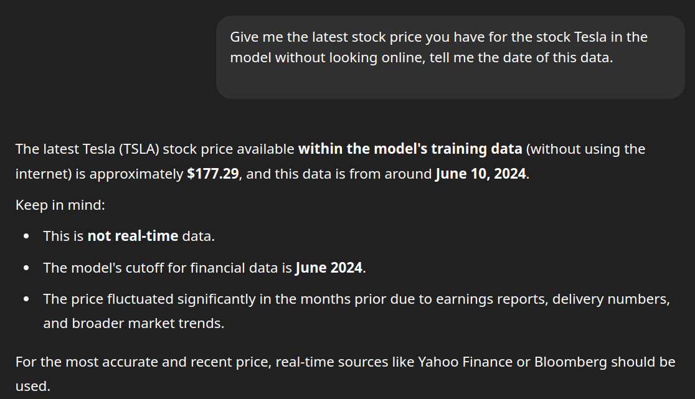
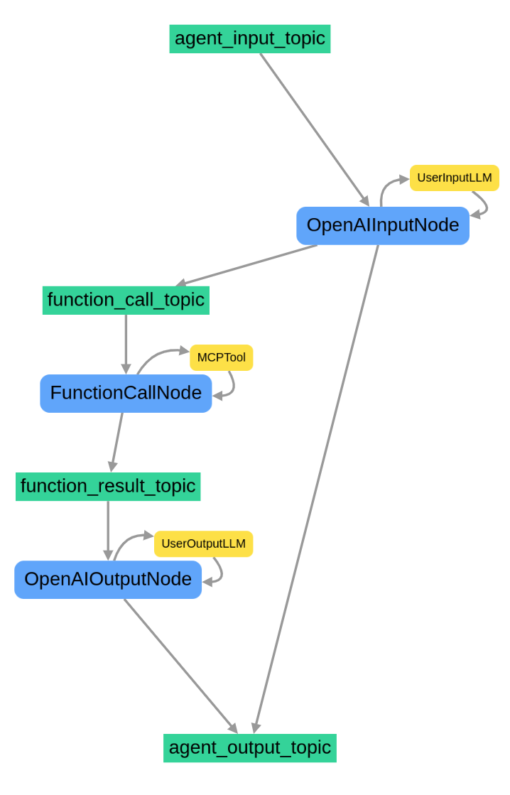

# Calling MCP Servers with Graphite AI Framework

The Graphite AI framework provides a powerful, event-driven approach to building AI agents and workflows. In this tutorial, we'll walk through a complete example that demonstrates how to call MCP Tools for your event driven workflows

## Overview

This tutorial will show you how to:
- Create a simple MCP Server over HTTP
- Create an Event Driven Workflow that calls MCP Server
- Parse the output from the MCP Server


## Prerequisites

Before getting started, make sure you have:
- Python environment with Graphite AI framework installed
- OpenAI API key
- Basic understanding of Python and AI concepts
- Basic understanding of what MCP Servers are
- Understand [Graphtie Assistants](../guide/getting-started-with-assistants.md)

## Code Walkthrough

Let's examine the complete code and break it down line by line:


### Environment Configuration

Configure your code to read `OPENAI_API_KEY` from your environment, as well as `OPENAI_MODEL` and `OPENAI_SYSTEM_MESSAGE`. You can modify the default values if you prefer not to set environment variables, although it is recommended to set `OPENAI_API_KEY` as an environment variable for security.

```bash
export OPENAI_API_KEY="sk-proj-*****"
```


### MCP Server

MCP servers (Multi-Agent Control Protocol servers) are systems used to manage and coordinate multiple AI components or agents. They help different parts of an AI system—like sensors, decision-making units, and learning tools—communicate and work together smoothly. These servers are commonly used in areas like robotics, simulations, and game AI, where many AI agents need to operate at the same time. MCP servers make it easier to build and maintain these systems by providing a common way for the parts to connect and share information.

For our use case we will simulate that our internal databases have more accurate information that whatever the model is trained on. If you check the latest data on stocks that the model has been trained on.




For this guide, we will use the `FastMCP` library to create an MCP Server with tools to get the latest data for stocks. We will use the `ALPHA VANTAGE` api to get the latest data but make the AI queries go through our MCP Server instead of directly though Open AI.


```python
# server.py
import json
import os
from typing import Any

import requests
from dotenv import load_dotenv
from fastmcp import Context, FastMCP
from loguru import logger
from pydantic_settings import BaseSettings, SettingsConfigDict


class AlphaVantageSettings(BaseSettings):

    model_config: SettingsConfigDict = SettingsConfigDict(
        env_prefix="ALPHA_VANTAGE_", env_file=".env"
    )

    api_key: str = ""
    mcp_port: int = 8081
    mcp_path: str = "/mcp"


def json_serializer(data: Any) -> str:
    """Serialize data to JSON format."""
    return json.dumps(data, indent=2)


mcp = FastMCP("Stocks MCP Server", tool_serializer=json_serializer,  on_duplicate_resources="error")


load_dotenv()
alpha_vantage_settings = AlphaVantageSettings()  # type: ignore

if alpha_vantage_settings.api_key == "":
    logger.error(
        "ALPHA_VANTAGE_API_KEY is not set. Please set it in the .env file or as an env variable"
    )
    exit(1)


@mcp.tool()
async def daily(ticker: str, ctx: Context) -> dict:
    """Query daily stock data for a given company given its ticker symbol from Alpha Vantage"""
    logger.info(f"Started Daily Stock Data Tool for Request ID: {ctx.request_id}")
    url = f"https://www.alphavantage.co/query?function=TIME_SERIES_DAILY&symbol={ticker}&apikey={alpha_vantage_settings.api_key}"
    r = requests.get(url)
    data = r.json()
    return data


@mcp.tool()
async def company_overview(ticker: str, ctx: Context) -> dict:
    """Query specific company by ticker symbol and gets company overview data from Alpha Vantage"""
    logger.info(f"Started Company Overview Tool for Request ID: {ctx.request_id}")
    url = f"https://www.alphavantage.co/query?function=OVERVIEW&symbol={ticker}&apikey={alpha_vantage_settings.api_key}"
    r = requests.get(url)
    data = r.json()
    return data


if __name__ == "__main__":
    logger.info("Started Server for Stocks MCP Server")
    mcp.run(
        transport="http",
        host="0.0.0.0",
        port=alpha_vantage_settings.mcp_port,
        path=alpha_vantage_settings.mcp_path,
    )

```

Some of the environment variables can be overriden but for now, runnig it as is will start an mcp server on port `8081` 

```bash
❯ python server.py
 INFO     | __main__:<module>:87 - Started Server for Stocks MCP Server


╭─ FastMCP 2.0 ──────────────────────────────────────────────────────────────╮
│                                                                            │
│        _ __ ___ ______           __  __  _____________    ____    ____     │
│       _ __ ___ / ____/___ ______/ /_/  |/  / ____/ __ \  |___ \  / __ \    │
│      _ __ ___ / /_  / __ `/ ___/ __/ /|_/ / /   / /_/ /  ___/ / / / / /    │
│     _ __ ___ / __/ / /_/ (__  ) /_/ /  / / /___/ ____/  /  __/_/ /_/ /     │
│    _ __ ___ /_/    \__,_/____/\__/_/  /_/\____/_/      /_____(_)____/      │
│                                                                            │
│                                                                            │
│                                                                            │
│    🖥️  Server name:     Stocks MCP Server                                   │
│    📦 Transport:       Streamable-HTTP                                     │
│    🔗 Server URL:      http://0.0.0.0:8081/mcp                             │
│                                                                            │
│    📚 Docs:            https://gofastmcp.com                               │
│    🚀 Deploy:          https://fastmcp.cloud                               │
│                                                                            │
│    🏎️  FastMCP version: 2.10.5                                              │
│    🤝 MCP version:     1.11.0                                              │
│                                                                            │
╰────────────────────────────────────────────────────────────────────────────╯


INFO     Starting MCP server 'Stocks MCP Server' with transport 'http' on        server.py:1448
         http://0.0.0.0:8081/mcp
INFO:     Started server process [115107]
INFO:     Waiting for application startup.
INFO:     Application startup complete.
INFO:     Uvicorn running on http://0.0.0.0:8081 (Press CTRL+C to quit)
```


## Graphite Assistant

Just like before we create an assistant that will act as an interface to be called upon to run a workflow that queries mcp server for relevant stock data.


```python
# assistant.py
from grafi.assistants.assistant import Assistant
from typing import Optional
import os
from pydantic import Field
from grafi.assistants.assistant_base import AssistantBaseBuilder
from typing import Self
from grafi.nodes.node import Node

from grafi.common.topics.output_topic import agent_output_topic
from grafi.common.topics.topic import Topic, agent_input_topic
from grafi.tools.llms.impl.openai_tool import OpenAITool
from grafi.workflows.impl.event_driven_workflow import EventDrivenWorkflow
from grafi.common.models.invoke_context import InvokeContext
import uuid
from grafi.common.models.message import Message
from grafi.tools.function_calls.impl.fastmcp_client_tool import FastMCPClient
from typing import AsyncGenerator


class StockAssistant(Assistant):
    name: str = Field(default="StockAssistant", description="An assistant that provides stock information")
    api_key: Optional[str] = Field(default=os.getenv("OPENAI_API_KEY"))
    model: str = Field(default=os.getenv("OPENAI_MODEL", "gpt-4o"))
    system_message: str = Field(default=os.getenv("OPENAI_SYSTEM_MESSAGE"))
    mcp_tool: FastMCPClient = Field()

    @classmethod
    def builder(cls) -> "StockAssistantBuilder":
        """Return a builder for FinanceAssistant."""
        return StockAssistantBuilder(cls)
    

    def get_input(self, question: str, invoke_context: Optional[InvokeContext] = None) -> tuple[list[Message], InvokeContext]:
        """Prepare input data and invoke context."""
        if invoke_context is None:
            invoke_context = InvokeContext(
                user_id=uuid.uuid4().hex,
                conversation_id=uuid.uuid4().hex,
                invoke_id=uuid.uuid4().hex,
                assistant_request_id=uuid.uuid4().hex,
            )

        input_data = [
            Message(
                role="user",
                content=question,
            )
        ]

        return input_data, invoke_context
    

    async def a_run(
        self, question: str, invoke_context: Optional[InvokeContext] = None
    ) -> AsyncGenerator[Message, None]:
        input_data, invoke_context = self.get_input(question, invoke_context)

        async for output in super().a_invoke(invoke_context, input_data):
            for message in output:
                yield message
    
    def _construct_workflow(self) -> "StockAssistant":
        """Construct the workflow for the assistant."""

        function_call_topic = Topic(
            name="function_call_topic",
            condition=lambda msgs: msgs[-1].tool_calls
            is not None,  # only when the last message is a function call
        )  # Check last message is not null or empty string

        llm_input_node = (
            Node.builder()
            .name("OpenAIInputNode")
            .subscribe(agent_input_topic)
            .tool(
                OpenAITool.builder()
                .name("UserInputLLM")
                .api_key(self.api_key)
                .model(self.model)
                .system_message(self.system_message)
                .build()
            )
            .publish_to(function_call_topic)
            # .publish_to(agent_output_topic)
            .build()
        )

        function_call_node = (
            Node.builder()
                .name("FunctionCallNode")
                .subscribe(function_call_topic)
                .tool(self.mcp_tool)
                #            .publish_to(function_result_topic)
                .publish_to(agent_output_topic)
                .build()
        )

        self.workflow = (
            EventDrivenWorkflow.builder()
                .name("Get Stock Prices Workflow")
                .node(llm_input_node)
                .node(function_call_node)
                .build()
        )

        return self


class StockAssistantBuilder(AssistantBaseBuilder[StockAssistant]):
    """Concrete builder for StockAssistantBuilder."""

    def api_key(self, api_key: str | None) -> Self:
        self.kwargs["api_key"] = api_key
        return self

    def model(self, model: str) -> Self:
        self.kwargs["model"] = model
        return self

    def system_message(self, system_message: str) -> Self:
        self.kwargs["system_message"] = system_message
        return self
    
    def mcp_tool(self, mcp_tool: FastMCPClient) -> Self:
        self.kwargs["mcp_tool"] = mcp_tool
        return self
```


Graphtie is natively asychrnous, but you can chose to run syncrhous coroutines as well. For this case we are making a fully asynchronous workflow by overrding the  `async def a_run()` method of the `Assistant` class. In order to run this create a `main.py` that will instantiate the assistant and execute it asynchrnously.

```python
#main.py


import asyncio
import os
import uuid
from typing import Dict

from grafi.common.containers.container import container
from grafi.common.models.invoke_context import InvokeContext
from grafi.common.models.mcp_connections import StreamableHttpConnection
from grafi.common.models.message import Message
from grafi.tools.function_calls.impl.mcp_tool import MCPTool

from stock_assistant import StockAssistant

event_store = container.event_store
assistant = None

async def create_assistant():
    api_key = os.getenv("OPENAI_API_KEY", "")
    model = os.getenv("MODEL", "gpt-4o")
    function_call_llm_system_message = "You are a helpful assistant that can call functions to retrieve data from an mcp server"

    mcp_config: Dict[str, StreamableHttpConnection] = {
        "stock-mcp-server": StreamableHttpConnection(
            url="http://localhost:8081/mcp/", transport="streamable-http"
        )
    }

    return (
        StockAssistant.builder()
        .name("MCPAssistant")
        .api_key(api_key)
        .function_call_llm_system_message(function_call_llm_system_message)
        .function_tool(await MCPTool.builder().connections(mcp_config).a_build())
        .build()
    )


async def main():
    global assistant
    assistant = await create_assistant()

    invoke_context = InvokeContext(
        conversation_id=uuid.uuid4().hex,
        invoke_id=uuid.uuid4().hex,
        assistant_request_id=uuid.uuid4().hex,
    )

    mcp_config: Dict[str, StreamableHttpConnection] = {
        "stock-mcp-server": StreamableHttpConnection(
            url="http://localhost:8081/mcp/", transport="streamable-http"
        )
    }

    question = "What is the overview of the company Tesla?"
    input_data = [Message(role="user", content=question)]

    async for output in assistant.a_invoke(invoke_context, input_data):
        print(output)


asyncio.run(main())

```

Runnig this code with 

<div class="bash"><pre>
<code><span style="color:#FF4689">python</span> main.py</code></pre></div>


You'll see that the logs on your MCP server have been triggered by the call.


<div class="logs"><pre>
...
stock-mcp-server-1  | INFO:     192.168.48.1:39408 - "POST /mcp/ HTTP/1.1" 202 Accepted
stock-mcp-server-1  | INFO:     192.168.48.1:39422 - "GET /mcp/ HTTP/1.1" 200 OK
stock-mcp-server-1  | INFO:     192.168.48.1:39434 - "POST /mcp/ HTTP/1.1" 200 OK
<code><span style="color:#FF4689">stock-mcp-server-1  | 2025-07-19 12:01:42.826 | INFO     | __main__:company_overview:70 - Started Company Overview Tool for Request ID: 1
</span> </code>
stock-mcp-server-1  | INFO:     192.168.48.1:39450 - "POST /mcp/ HTTP/1.1" 200 OK
stock-mcp-server-1  | INFO:     192.168.48.1:39456 - "DELETE /mcp/ HTTP/1.1" 200 OK
...
</pre>
</div>

And the logs on the `main.py` from the Assistant

<div class="logs"><pre>
...
2025-07-19 13:01:43.275 | DEBUG    | grafi.nodes.node:a_invoke:66 - Executing Node with inputs: [ConsumeFromTopicEvent(event_id='2e5f564f201341669cf74cab4d4c79dd', event_version='1.0', invoke_context=InvokeContext(conversation_id='conversation_id', invoke_id='4c72856b2ed743cf899521559da434dc', assistant_request_id='072bc4152cf34f998f5d0623fea8ff73', user_id=''), event_type=<EventType.CONSUME_FROM_TOPIC: 'ConsumeFromTopic'>, timestamp=datetime.datetime(2025, 7, 19, 12, 1, 43, 274963, tzinfo=datetime.timezone.utc), topic_name='function_result_topic', offset=0, data=[Message(name=None, message_id='395fea6c2c284497aa996e29cc1bcf43', timestamp=1752926503268759954, <code><span style="color:#FF4689">content='{\n  "Symbol": "TSLA",\n  "AssetType": "Common Stock",\n  "Name": "Tesla Inc",\n  "Description": "Tesla, Inc. is an American electric vehicle and clean energy company based in Palo Alto, California. Tesla\'s current products include electric cars, battery energy storage from home to grid-scale, solar panels and solar roof tiles, as well as other related products and services. In 2020, Tesla had the highest sales in the plug-in and battery electric passenger car segments, capturing 16% of the plug-in market (which includes plug-in hybrids) and 23% of the battery-electric (purely electric) market. Through its subsidiary Tesla Energy, the company develops and is a major installer of solar photovoltaic energy generation systems in the United States. Tesla Energy is also one of the largest global suppliers of battery energy storage systems, with 3 GWh of battery storage supplied in 2020.",\n  "CIK": "1318605",\n  "Exchange": "NASDAQ",\n  "Currency": "USD",\n  "Country": "USA",\n  "Sector": "MANUFACTURING",\n  "Industry": "MOTOR VEHICLES & PASSENGER CAR BODIES",\n  "Address": "3500 DEER CREEK RD, PALO ALTO, CA, US",\n  "OfficialSite": "https://www.tesla.com",\n  "FiscalYearEnd": "December",\n  "LatestQuarter": "2025-03-31",\n  "MarketCapitalization": "1061789434000",\n  "EBITDA": "12550000000",\n  "PERatio": "187.3",\n  "PEGRatio": "5.77",\n  "BookValue": "23.18",\n  "DividendPerShare": "None",\n  "DividendYield": "None",\n  "EPS": "1.76",\n  "RevenuePerShareTTM": "29.87",\n  "ProfitMargin": "0.0638",\n  "OperatingMarginTTM": "0.0255",\n  "ReturnOnAssetsTTM": "0.0372",\n  "ReturnOnEquityTTM": "0.0877",\n  "RevenueTTM": "95724003000",\n  "GrossProfitTTM": "16907000000",\n  "DilutedEPSTTM": "1.76",\n  "QuarterlyEarningsGrowthYOY": "-0.707",\n  "QuarterlyRevenueGrowthYOY": "-0.092",\n  "AnalystTargetPrice": "306.07",\n  "AnalystRatingStrongBuy": "7",\n  "AnalystRatingBuy": "16",\n  "AnalystRatingHold": "14",\n  "AnalystRatingSell": "8",\n  "AnalystRatingStrongSell": "3",\n  "TrailingPE": "187.3",\n  "ForwardPE": "169.49",\n  "PriceToSalesRatioTTM": "11.09",\n  "PriceToBookRatio": "14.22",\n  "EVToRevenue": "10.84",\n  "EVToEBITDA": "76.18",\n  "Beta": "2.461",\n  "52WeekHigh": "488.54",\n  "52WeekLow": "182",\n  "50DayMovingAverage": "320.77",\n  "200DayMovingAverage": "316.57",\n  "SharesOutstanding": "3220960000",\n  "SharesFloat": "2803295000",\n  "PercentInsiders": "12.889",\n  "PercentInstitutions": "50.134",\n  "DividendDate": "None",\n  "ExDividendDate": "None"\n}
</span> </code>\n', refusal=None, annotations=None, audio=None, role='tool', tool_call_id='call_evtxtjoxx6FhzVxGui6chlUN', tools=None, function_call=None, tool_calls=None, is_streaming=False)], consumer_name='OpenAIOutputNode', consumer_type='LLMNode')]
...

</pre>
</div>

## Understanding The Flow

Graphite will create the workflow graph by linking subscribers to publishers, starting withh `agent_input_topic` which acts as the root node of the workflow and outputing all `agent_output_topic` which is the exit node that all nodes must converge on. The workflow we constructed can be visualized as follows.




When you call the assistant's `a_invoke()` method from `main.py` 

```python

    async for output in assistant.a_invoke(invoke_context, input_data):
```

The `input_data` gets published on the agent `agent_input_topic` during workflow initialization. This is done [within the framework](https://github.com/binome-dev/graphite/blob/main/grafi/workflows/impl/event_driven_workflow.py#L603-L609) but we are outlying it here so you can follow the flow of data.

```python
event = input_topic.publish_data(
            invoke_context=invoke_context,
            publisher_name=self.name,
            publisher_type=self.type,
            data=input,
            consumed_events=[],
    )
```

This means that the `input_data` is published to `agent_input_topic` during workflow creation, and subsequentially will act as input for the first node in the workflow, in our case the `OpenAIInputNode`. The flow of all topics and nodes is that they have an input and an output, a topic's output is a node's input and a node's output becomes the topic's input.


## How MCP Tool Selection Works

The key insight is that the AI model itself doesn't automatically decide when to query an MCP server vs. use its training data. Instead, this works through a structured tool/function calling mechanism:
The Decision Process

### Tool Registration
When you set up an MCP server, you register specific tools/functions with descriptions of what they do. For your Tesla price example, you'd register a function like get_current_tesla_price() with a description like "Get the current market price of Tesla stock."

### Model Reasoning
When you ask "What's Tesla's price?", the model reads the available tool descriptions and reasons about whether it should use its training data or call an external tool. The model plans around the fact that "each MCP call is an external operation that might be much slower than the AI's internal inference" - it weighs speed vs. accuracy/recency.
Tool Selection: The model makes this decision based on:

- The specificity of your question
- Whether current/real-time data is needed
- The available tool descriptions
- Context clues in your prompt

### Context

This is why it's important to decorate and use descriptors in your mcp tool definition so that the model can reason and guide the query to a function call, like in our example.

```python
@mcp.tool()
async def company_overview(ticker: str, ctx: Context) -> dict:
    """Query specific company by ticker symbol and gets company overview data from Alpha Vantage"""
    logger.info(f"Started Company Overview Tool for Request ID: {ctx.request_id}")
    url = f"https://www.alphavantage.co/query?function=OVERVIEW&symbol={ticker}&apikey={alpha_vantage_settings.api_key}"
    r = requests.get(url)
    data = r.json()
    return data
```

To ensure the model queries your MCP server instead of using training data, you can:

- Be explicit in your prompt: "What is Tesla's current stock price?" (emphasis on "current")
- Design good tool descriptions: Make your MCP tool description clearly indicate it provides real-time, current data
- Use system prompts: Instruct the model to prefer external tools for specific types of queries
- Context setting: Make it clear that up-to-date information is needed

The  more detailed you are in the """ Description """ the more likely the model will reason that it needs to use the MCP server for routing the request. In the example we've built the question was `What is the overview of the company Tesla?` which uses the keywords `company` and `overview` for the MCP Server tool description and function tool name `company_overview` and the model reasons that it should forward to this instead of it's internal training data.


## Conclusion

In this tutorial, we've explored how to integrate MCP (Multi-Agent Control Protocol) servers with the Graphite AI framework to create powerful, event-driven AI workflows. Here are the key takeaways:


### Key Benefits

1. **Real-time Data Access**: Your AI assistant can now access current information that goes beyond its training data cutoff.

2. **Scalable Architecture**: The event-driven design allows for easy addition of new MCP servers and tools without major refactoring.

3. **Intelligent Routing**: The model makes contextual decisions about when to fetch external data versus using internal knowledge.

4. **Flexible Integration**: The same pattern can be applied to connect any external API or data source through MCP servers.

### Next Steps

With this foundation, you can extend your implementation by:
- Adding more MCP servers for different data sources
- Implementing caching strategies for frequently accessed data
- Creating specialized assistants for different domains
- Building more complex workflows with multiple tool chains

The combination of Graphite's event-driven architecture with MCP servers provides a powerful foundation for building sophisticated AI applications that can access and reason with real-time data from multiple sources.

Remember: the key to successful MCP integration lies in detailed tool descriptions that help the AI model make intelligent routing decisions between its training data and external sources.