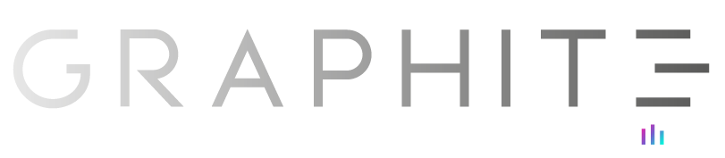

# 

**Graphite** is an open-source framework for creating **domain-specific AI assistants** via composable, agentic workflows. It emphasizes loose coupling and well-defined interfaces, enabling developers to construct flexible, modular systems. Each major layer – **assistant, node, tool,** and **workflow** – has a clear role in orchestrating or executing tasks, with events serving as the single source of truth for every state change or data exchange.

This documentation details how **Graphite's event-driven architecture** seamlessly supports complex business logic, from initial user requests through advanced tool integrations (e.g., LLM calls, function calls, MCP servers, and external APIs). Dedicated topics manage pub/sub operations, providing mechanisms for input, output, and human-in-the-loop interactions. Meanwhile, commands encapsulate invoke logic for each tool, allowing nodes to delegate work without tight coupling.

Four critical capabilities—**observability, idempotency, auditability,** and **restorability**—underpin Graphite’s suitability for production AI environments. Observability is achieved via event sourcing and OpenTelemetry-based tracing, idempotency through carefully managed event stores and retry logic, auditability by logging every action and data flow, and restorability by maintaining offset-based consumption records that let workflows resume exactly where they left off.

Overall, **Graphite** offers a powerful, extensible foundation for building AI solutions that scale, adapt to evolving compliance needs, and gracefully handle failures or user-driven pauses. By combining a robust workflow engine, well-structured nodes and tools, and a complete event model, Graphite enables teams to develop sophisticated conversational agents and automated pipelines with confidence.

## Key Features

**Event-Driven Architecture**: Built on a pub/sub pattern where Topics manage message flow between Nodes, enabling loose coupling and flexible workflow composition.

**Modular Workflow Components**: Construct AI agents using composable layers - Assistants orchestrate Workflows, Workflows coordinate Nodes, and Nodes execute Tools.

**Multiple LLM Integrations**: Out-of-the-box support for OpenAI, Claude, Gemini, Ollama, DeepSeek, and OpenRouter, with a consistent interface across all providers.

**Function Calling Support**: Seamlessly integrate custom Python functions with LLMs through the FunctionCallTool, enabling agents to interact with external APIs and services.

**MCP Server Integration**: Connect to Model Context Protocol servers for dynamic tool discovery and external data source access.

**Production-Ready Features**: Built-in observability via OpenTelemetry, event sourcing for auditability, idempotent operations, and workflow restorability for fault tolerance.

## Who Should Use Graphite?

Graphite is designed for developers and teams building AI-powered applications, including:

- **AI Engineers** building conversational agents with complex reasoning capabilities
- **Backend Developers** integrating LLM functionality into production systems
- **MLOps Teams** deploying observable, auditable AI workflows
- **Researchers** prototyping multi-step AI agents with tool use

## Getting Started

This documentation will guide you through:

1. **Installation and Setup** - Get Graphite running in your environment
2. **Core Concepts** - Understand the architecture: Assistants, Workflows, Nodes, and Tools
3. **Building Workflows** - Create event-driven AI pipelines
4. **Tool Integration** - Add LLMs, function calls, and MCP servers
5. **Observability** - Configure tracing with Arize and Phoenix
6. **Advanced Topics** - Event stores, workflow recovery, and custom tools

Ready to dive in? Start with our [Quick Start Guide](./getting-started/quickstart.md) to build your first AI agent, or explore the [Architecture](./user-guide/architecture.md) to understand how Graphite components work together.

## Community and Support

Graphite is actively developed and maintained by the open-source community. Join us:

- **GitHub**: [github.com/binome-dev/graphite](https://github.com/binome-dev/graphite)
- **Issues and Feature Requests**: Use GitHub Issues for bug reports and feature requests
- **Discussions**: Join community discussions and get help from other users
- **Contributing**: Check out our contribution guidelines to help improve Graphite
