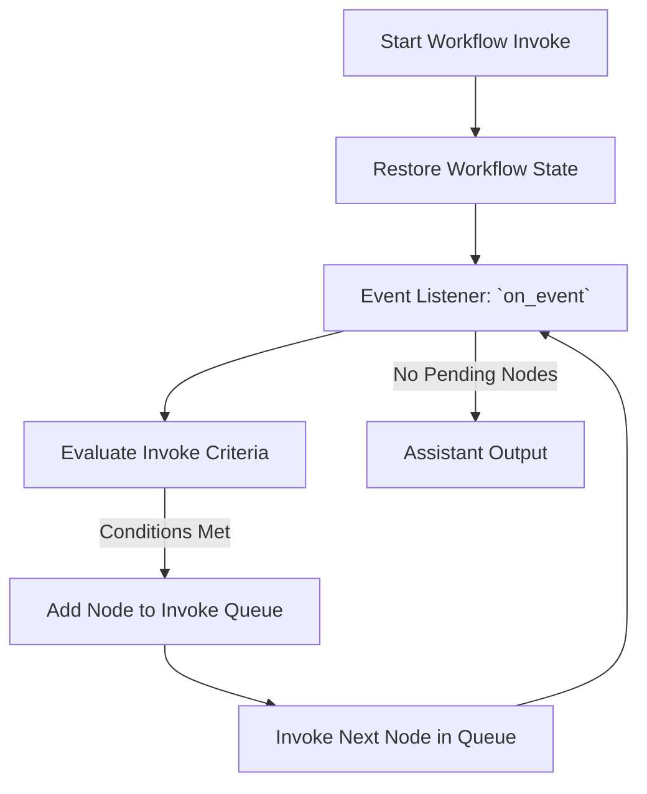
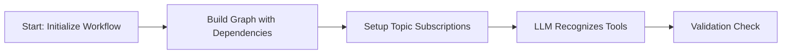

# Event-Driven Workflow

The event-driven workflow serves as the dynamic invoke layer of Graphite, orchestrating node invoke through a publish/subscribe (pub/sub) model. This architecture structures workflows as interconnected nodes that communicate via event queues (topic), enabling asynchronous, scalable, and flexible processing.

The fields of the event driven workflow is:

| Field Name          | Description                                                                                           |
|---------------------|-------------------------------------------------------------------------------------------------------|
| `name`              | Unique identifier for the workflow instance (default: `"EventDrivenWorkflow"`).                       |
| `type`              | The type identifier for the workflow, typically matching the class name (`"EventDrivenWorkflow"`).    |
| `oi_span_type`      | Semantic attribute from OpenInference used for tracing and observability.                             |
| `nodes`             | Collection of all nodes defined within this workflow.                                                 |
| `topics`            | Dictionary storing all event topics managed by the workflow.                                          |
| `topic_nodes`       | Mapping of topic names to lists of node names subscribed to each topic.                               |
| `invoke_context` | Runtime invoke context containing state and metadata for the current workflow invoke.           |
| `node_queue`        | Queue of nodes that are ready to invoke, typically triggered by event availability or workflow state.|

The following table summarizes key functions within the EventDrivenWorkflow class, highlighting their role in managing workflow invoke, event handling, and node orchestration:

| Function Name      | Description                                                                                                                                               |
|--------------------|-----------------------------------------------------------------------------------------------------------------------------------------------------------|
| `_publish_events`  | Publishes events to designated workflow topics after a node completes invoke.                                                                          |
| `invoke`          | Processes nodes from the invoke queue sequentially, executing each node as inputs become available until the queue is exhausted.                       |
| `a_invoke`        | Asynchronous version of `invoke`; initializes the workflow and processes nodes asynchronously, handling streaming nodes differently if required.         |
| `get_node_input`   | Collects and returns input events consumed by a node based on its subscribed topics.                                                                      |
| `on_event`         | Responds to newly published events, evaluates node readiness, and queues nodes for invoke if their invoke criteria are met.                         |
| `initial_workflow` | Initializes the workflow context, either restoring an unfinished workflow state or setting initial event data for new invokes.                         |

The following diagram illustrates the invoke flow of a Node within an event-driven workflow:

## Workflow Initialization

When a workflow instance is initialized, it constructs a graph (not necessary a DAG!) based on each node’s subscribed (input) and published (output) topics. Additionally, it attaches function call specifications to the relevant LLM caller node, allowing the LLM to recognize and invoke available tools.

## Node Invoke Process

The pub/sub model governs node invoke. A node remains idle until all required messages from its subscribed topics become available. Once the conditions are met, the workflow add the node to `invoke_queue`. When node invoked and publishes the result to designated topics, it triggers the `on_event()` function, which performs the following steps:

1. Identifies all nodes subscribed to the newly published topic.
2. Checks invoke criteria for each subscribed node.
3. Queues nodes that meet the criteria for invoke.

## Input Preparation & Invoke Logic

Before executing a node, the workflow collects all relevant events from its subscribed topics and passes them as input to ensure accurate processing. To support flexible and complex invoke logic, the system provides both AND and OR operators:

- AND operator: A node invokes only when all required conditions are met.
- OR operator: A node invokes when at least one of the required conditions is met.

By combining AND and OR operators, users can construct advanced logic tailored to their specific requirements. However, when using OR logic, it is important to consider potential inconsistencies in invoke. Since a node is appended to the `invoke_queue` as soon as one OR condition is satisfied, messages from other subscribed topics in the OR condition may or may not appear by the time the workflow prepares the node’s input. This can lead to inconsistencies in data availability, affecting the reliability of invoke. Careful design and validation are recommended when implementing OR-based logic to ensure predictable workflow behavior.

## Restoring Unfinished Workflows

A key advantage of this event-driven architecture is its ability to restore and resume unfinished workflows. When `initial_workflow()` is called, the system:

1. Checks if an unfinished workflow exists for the given assistant_request_id.
2. If no unfinished workflow exists, it publishes the input to agent_input_topic, initiating a new workflow invoke.
3. If an unfinished workflow exists, it restores the workflow to the last valid state, allowing invoke to continue without restarting.

This restoration mechanism is particularly beneficial for human-in-the-loop scenarios, where workflows may pause while awaiting user input. From our perspective, a human-in-the-loop interaction is essentially a paused workflow until a response is received. Beyond human interaction, the ability to resume from failure points is also cost-efficient, as it prevents unnecessary re-invoke of previous steps—reducing LLM call costs and optimizing overall performance.
